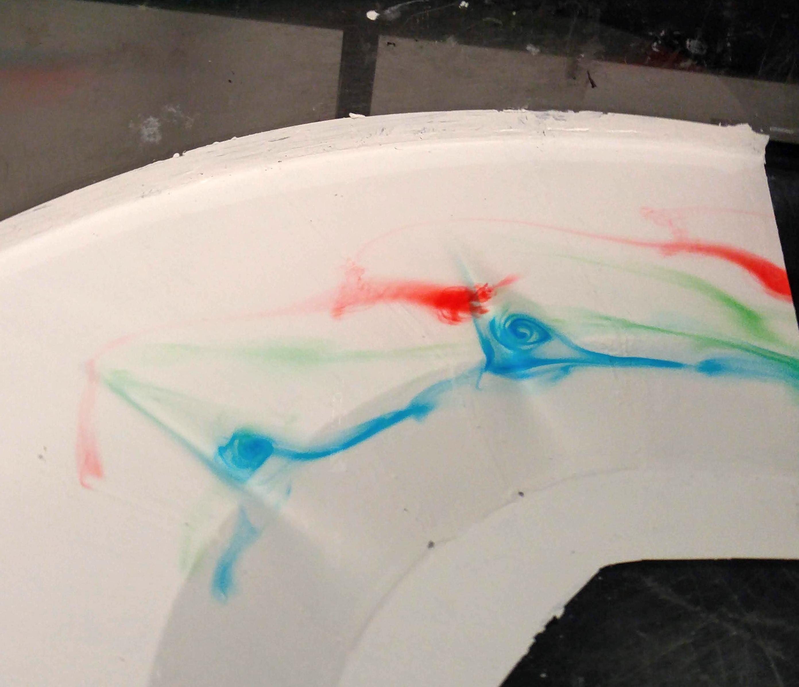
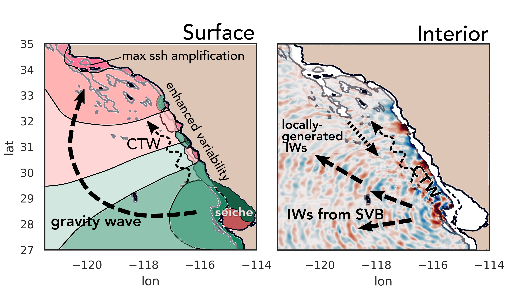

### Cross shelf exchange induced by submarine canyons

::: {.grid}

::: {.g-col-12 .g-col-md-4}

:::

::: {.g-col-12 .g-col-md-8}
My research focuses on understanding the role of submarine canyons in cross-shelf exchange 
and coastal circulation. Submarine canyons, which incise continental shelves worldwide, 
are biodiversity hotspots because they act as conduits for biologically relevant tracers 
such as nitrate and phosphate by enhancing upwelling. I investigate how canyons influence the 
amount and distribution of tracers and water exchanged between the shelf and the deep ocean on timescales
ranging from days to a year, under the influence of processes such as coastal trapped waves, 
internal tides, winds, and alongshore currents. Using both idealized configurations and 
regional applications of the MIT general circulation model (MITgcm), I study how canyon geometry, 
geographic setting, and local mixing conditions control the transport of tracers and their 
spatial and temporal patterns on the shelf. Ultimately, my work aims to develop a scaling framework 
for predicting canyon-driven tracer exchange and its implications for shelf ecosystems and biogeochemistry.

**Relevant publications:**

* Saldías, G. S., Ramos-Musalem, K., & Allen, S. E. (2021). Circulation and upwelling induced by coastal trapped waves over a submarine canyon in an idealized eastern boundary margin. Geophysical Research Letters, 48, e2021GL093548. https://doi.org/10.1029/2021GL093548 

* Ramos‐Musalem, K., & Allen, S. E. (2020). The Impact of Initial Tracer Profile on the Exchange and On‐Shelf Distribution of Tracers Induced by a Submarine Canyon. Journal of Geophysical Research: Oceans, 125(3), e2019JC015785. https://doi.org/10.1029/2019JC015785

* Ramos-Musalem, K., & Allen, S. E. (2019). The Impact of Locally Enhanced Vertical Diffusivity on the Cross-Shelf Transport of Tracers Induced by a Submarine Canyon. Journal of Physical Oceanography, 49(2), 561-584. https://doi.org/10.1175/JPO-D-18-0174.1

* [PhD Thesis](https://open.library.ubc.ca/cIRcle/collections/ubctheses/24/items/1.0388506)

* Esteban Cruz Isidro's [BSc Thesis](https://ru.dgb.unam.mx/items/0d253f28-fd2c-42f4-9139-ae7ef8c3d645) (in Spanish)

:::

:::

### The shape of the coastline

::: {.grid}

::: {.g-col-12 .g-col-md-4}

:::

::: {.g-col-12 .g-col-md-8}
What variability do we miss in our regional models if we do not include Sebastián Vizcaino Bay?

**Relevant publications:**

* Ramos-Musalem, K., Gille, S. T., Cornuelle, B. D., & Mazloff, M. R. (2023). High-frequency variability induced in the Southern California Bight by a wind event in Sebastián Vizcaíno Bay, Baja California. *Journal of Geophysical Research: Oceans*, e2022JC019547. DOI:[10.1029/2022JC019547](https://doi.org/10.1029/2022JC019547).
* Amelia thelanderson's MSc. Thesis (2023)
* Esteban Cruz Isidro's MSc Thesis (2025)

:::

:::

## Funded projects
:::{#projects}
:::

<!--Include social share buttons-->


