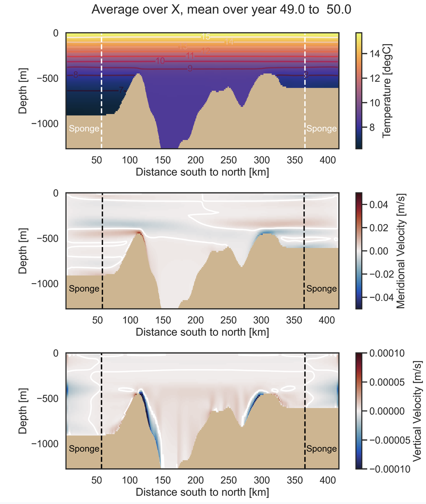

I am a physical oceanographer interested in how stratified ocean flows interact with complex topography, and how these interactions control transport, mixing, and exchange in the coastal ocean.

My research combines numerical modeling, observations and theory, with a particular focus on Baja California and the Gulf of California. I am especially interested in connections across scales: from internal waves and tides to coastal-trapped waves and mesoscale circulation.

### Flow–topography interactions and coastal exchange

::: {.grid}

::: {.g-col-12 .g-col-md-4}

:::

::: {.g-col-12 .g-col-md-8}
*How do submarine canyons and other topographic features modify coastal circulation and transport?*

Submarine canyons can strongly alter currents, vertical transport, mixing, and exchange between the continental shelf and the deep ocean. Our work investigates how these processes depend on stratification, tides, mixing, winds, background currents, and canyon geometry.

A current focus is Punta Banda Canyon, at the entrance of Todos Santos Bay, Ensenada, Baja California. We use observations and numerical experiments to study tidal and residual exchange, internal tides, and the interaction between canyon geometry and the surrounding coastal circulation. Punta Banda serves as a natural laboratory for understanding processes that may occur in submarine canyons elsewhere.

Keywords: submarine canyons, cross-shelf exchange, tidal rectification, mixing, tracer transport, MITgcm

:::

:::

### Internal waves and coastal-trapped waves

::: {.grid}

::: {.g-col-12 .g-col-md-4}

:::

::: {.g-col-12 .g-col-md-8}
*How is wave energy generated, transmitted, and transformed in a coastal ocean with realistic topography?*

We study both internal waves and lower-frequency coastal-trapped waves, particularly how their propagation is modified by stratification and bathymetry.

In Punta Banda Canyon, we are investigating internal-tide generation and propagation and how changes in stratification associated with seasonal upwelling and low-frequency motions modify internal-tide energy.

Farther south, our work in Sebastián Vizcaíno Bay examines coastal-trapped waves generated by wind events and how shelf width, slope, and small-scale bathymetric roughness modify their propagation toward Southern California.

We also use idealized models to investigate how wind-driven oscillations in semi-enclosed bays can transfer energy from surface motions into internal waves.

Keywords: internal tides, internal waves, coastal-trapped waves, wave energetics, stratification, flow–topography interaction
:::

:::

### Sills, overflows, and marginal-sea exchange

::: {.grid}

::: {.g-col-12 .g-col-md-4}

:::

::: {.g-col-12 .g-col-md-8}
*What controls the exchange of water between semi-enclosed basins and the open ocean?*

The narrow channels and sills of the northern Gulf of California provide an excellent setting for studying interactions among buoyancy forcing, tides, mixing, and topographically controlled flows.

With Amelia Thelandersson and Manuel Lopez, we are using idealized numerical experiments to understand bottom-water renewal, overflows, upwelling, and exchange across the sills surrounding the Ballenas Channel, and how these processes contribute to the unusual hydrography of the northern Gulf.

(*Image: Amelia Thelandersson*)

Keywords: overflows, marginal seas, tidal pumping, water-mass exchange

:::

:::

### Broader geophysical fluid dynamics

::: {.grid}

::: {.g-col-12 .g-col-md-4}

:::

::: {.g-col-12 .g-col-md-8}
Although most of my current research concerns the ocean, I am broadly interested in stratified geophysical flows interacting with topography.

This has also included atmospheric mountain waves, particularly the response of the atmosphere to the complex topography surrounding the Valley of Mexico. A previous project explored this problem through numerical modeling and student projects.

The oceanic and atmospheric problems share much of the same underlying physics: stratification, rotation, waves, topographic steering, and the transfer of momentum and energy across scales.

(*Image: Eva Rojas*)
:::

:::

## Funded projects
:::{#projects}
:::

