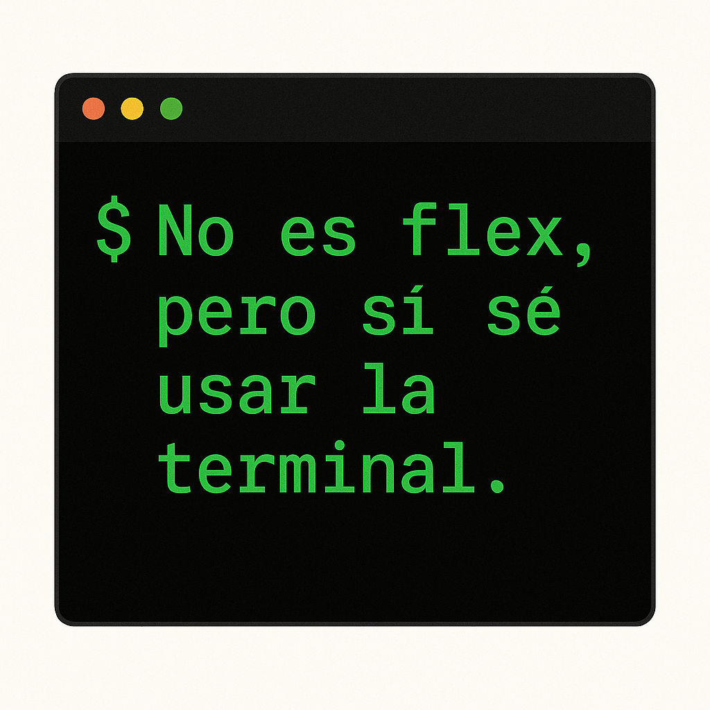
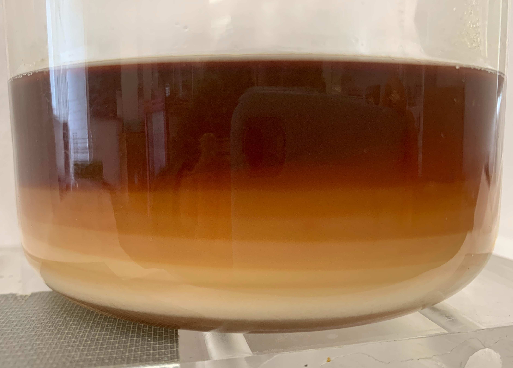

Most resources in Spanish.

## Oceanografía Dinámica I

::: {.grid}

::: {.g-col-12 .g-col-md-2}

:::

::: {.g-col-12 .g-col-md-10}

2025-I, &nbsp; [2026-I](teaching/ocedin1_2026.qmd)

Graduate program in Physical Oceanography, CICESE

:::

:::

## Introducción a la programación científica

::: {.grid}

::: {.g-col-12 .g-col-md-2}

:::

::: {.g-col-12 .g-col-md-10}

[Septiembre 2025](teaching/intro_scicomp_2025.qmd)

3-day bootcamp for PO graduate students at CICESE.

:::

:::

## Other courses

::: {.grid}

::: {.g-col-12 .g-col-md-2}

:::

::: {.g-col-12 .g-col-md-10}

At UNAM, Faculty of Science (undergraduate)
  
    * Taller de Modelación Numérica (2021-II, 2022-II)
    * Dinámica de Fluidos Geofísicos (2022-I, 2024-I)
    * Introducción a la Oceanografía Física (2023-I)
    * Técnicas Experimentales (2021-I)

At UNAM, Earth Sciences Graduate Program

    * Oceanografía Dinámica I (2023-I)
    * Oceanografía Dinámica II (2023-II)

:::

:::

