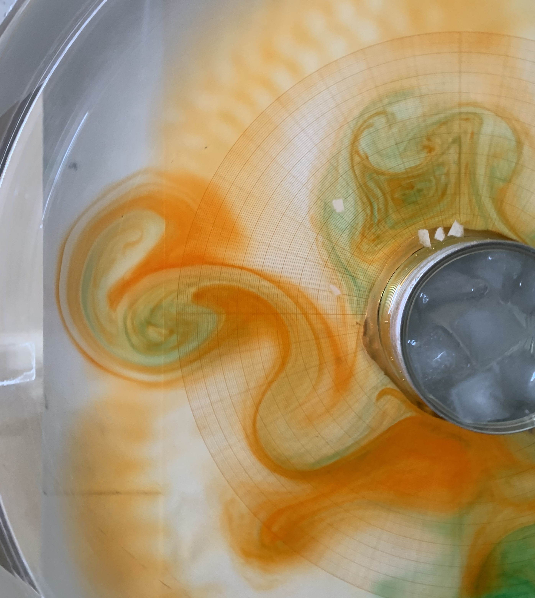

Most resources in Spanish.

## Oceanografía Dinámica I

::: {.grid}

::: {.g-col-12 .g-col-md-2}

:::

::: {.g-col-12 .g-col-md-10}

[2025-I](https://www.google.com), &nbsp; [2026-I](teaching/ocedin1_2026.qmd)

Graduate program in Physical Oceanography, CICESE

:::

:::

## At Faculty of Science, UNAM (Undergraduate)

::: {.grid}

::: {.g-col-12 .g-col-md-2}

:::

::: {.g-col-12 .g-col-md-10}

Taller de Modelación Numérica (2021-II, 2022-II)

Dinámica de Fluidos Geofísicos (2022-I, 2024-I)

Introducción a la Oceanografía Física (2023-I)

Técnicas Experimentales (2021-I)
:::

:::

## Earth Science Graduate Program, UNAM

::: {.grid}

::: {.g-col-12 .g-col-md-2}

:::

::: {.g-col-12 .g-col-md-10}

Dynamical Oceanography I (2023-I)

Dynamical Oceanography II (2023-II)

:::

:::

