       
#  Del curso

## Instructorxs

Profesora: [Karina Ramos Musalem](https://anakarinarm.github.io/) (kramosmu@cicese.mx)

Profesor: Manuel López (malope@cicese.mx)

Ayudante: Alejandro Dominguez Guadarrama (adomingu@cicese.edu.mx)

## Horario

**Clases**  
    
- Lunes 8:30-10:30
- Miércoles 8:30-10:30
- Viernes 9:00-10:20 ("laboratorio")

Laboratorio incluye algunas demostraciones experimentales y prácticas numéricas con jupyter notebooks.

Dudas por correo, en el cubículo o en Classroom para que todes participemos :-)

## Temario del curso

Pueden consultar el temario en classroom.

* Folder "Bibliografía" en Classroom
* Les iremos indicando las referencias principales de cada tema a lo largo del curso.

## Evaluación{.smaller}

 Tareas 45%
 
 Parciales 45%
 
 Exposición de artículo 10%

 
**Tareas**: Habrá aproximadamente 7 en el semestre (~ 1 cada 2 semanas). Se entregan individualmente. Las prácticas de python cuentan como parte de la tarea correspondiente a esa semana.
 
**Parciales:** Habrá al menos dos exámenes parciales. El *twist* es que 80% de su calificación será del examen individual y 20% del examen en equipo (En mi examen).
 
**Exposición de un artículo:** 
- Más detalles pronto
 

## Código de conducta
Decidamos entre todes las reglas de convivencia del curso (pizarrón).

## Introducción{.smaller}

Esta clase es de dinámica del océano, pero en general veremos conceptos que aplican a *flujos geofísicos* en general.

¿De qué hablamos cuando hablamos de flujos geofísicos?

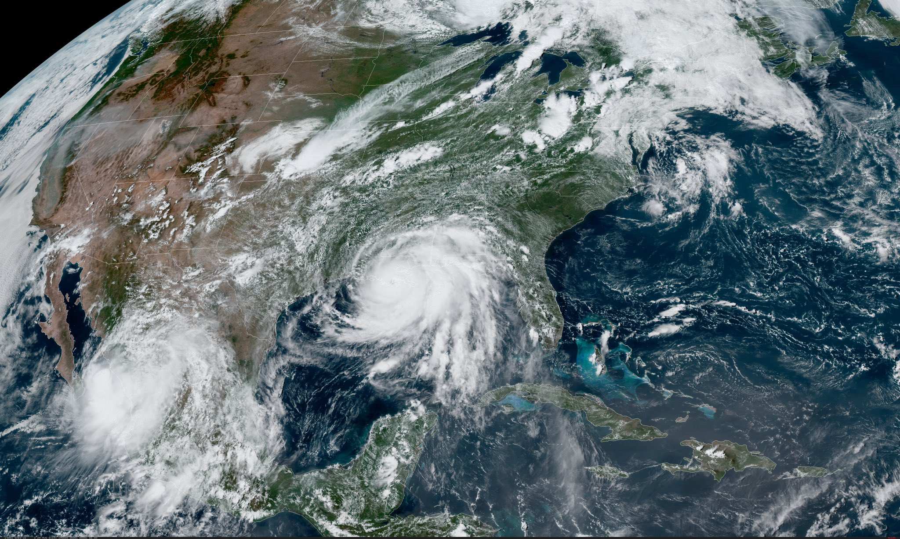

::: aside
Huracanes Nora (izq.) e Ida (der.)
Fuente: NOAA Satellites
:::

## Características de los fluidos geofísicos (FG)

* Se encuentran en un sistema de referencia en **rotación**;
* por lo regular están **estratificados** y son **turbulentos**;
* En la naturaleza ocurren a "gran escala" (en un momento definiremos "gran").

Este curso tratará de las peculiaridades que aparecen en la dinámica del flujo debidas a la influencia de una, otra o ambas características.

## Otros ejemplos {.smaller}

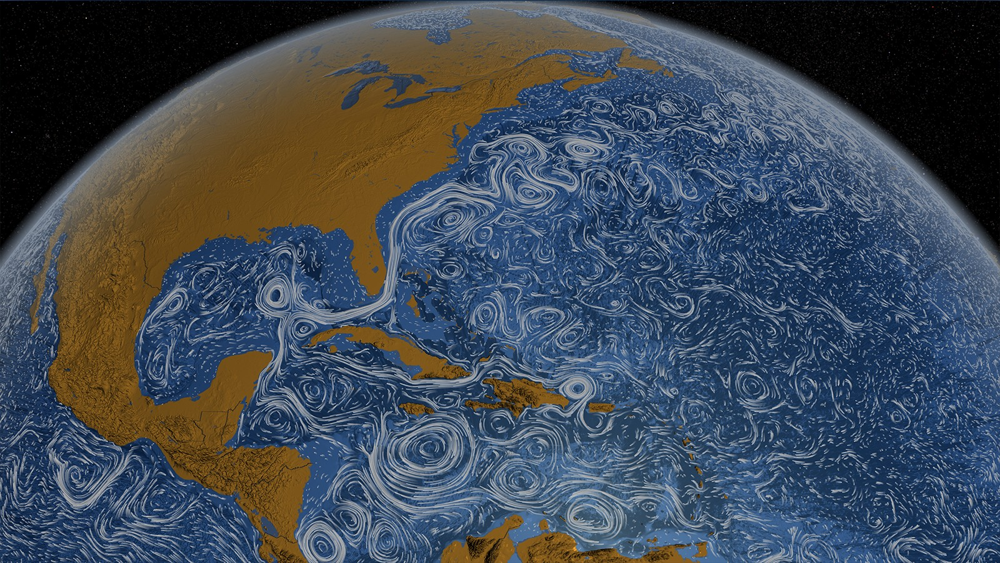

::: aside
Fuente: NOAA [Atlantic Oceanographic and Meteorological Laboratory](https://www.aoml.noaa.gov/news/anticyclonic-eddies-off-cuban-coast/)
:::

Estructuras de mesoescala (ciclones, tiempo oceánico) y submesoescala (remolinos, frentes, surgencias, etc).

## Productividad biológica {.smaller}
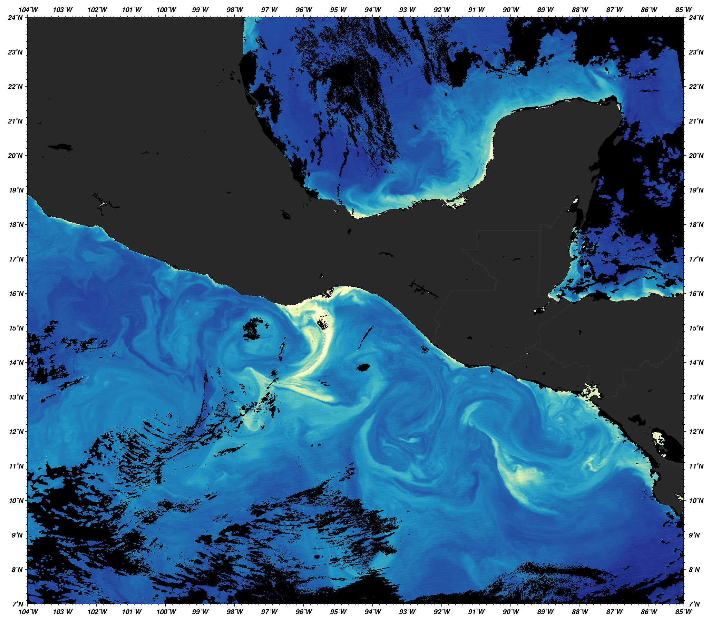

::: aside
Fuente: NASA Identifier: ge_05147. Clorofila en el Golfo de Tehuantepec en enero 4 del 2005, tomada por el Moderate Resolution Imaging Spectroradiometer (MODIS) en el satélite  Aqua de NASA.
:::

## Efecto de la estratificación

La **estratificación** es la variación vertical de la densidad.

## Frecuencia de Brunt-Väisälä {.smaller}

:::: {.columns}

::: {.column width="40%"}

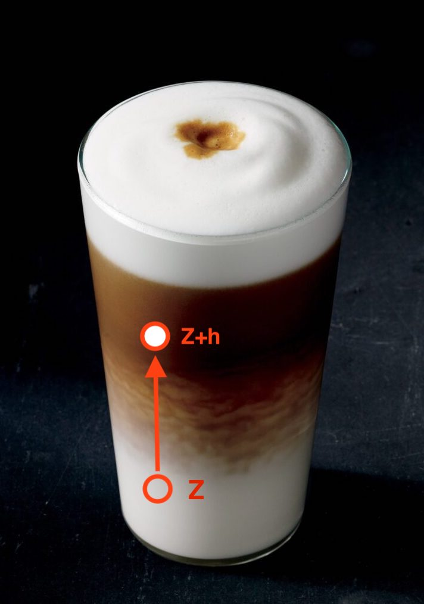

:::

:::{.column width="60%"}

Muevo elemento de fluido en equilibrio de $Z$ hasta $Z+h$ $\rightarrow$ **fuerza boyante**

La frecuencia de oscilación^[Conocida como frecuencia de Brunt-Väisälä] del elemento de fluido está dada por:
$$N^2=\frac{g}{\rho_0}\frac{\partial{\rho}}{\partial z}$$

$\uparrow N^2$ inhibe movimientos verticales y da estructura vertical al flujo.

:::

::::

## Efecto de la rotación {.smaller}

:::: {.columns}

::: {.column width="40%"}

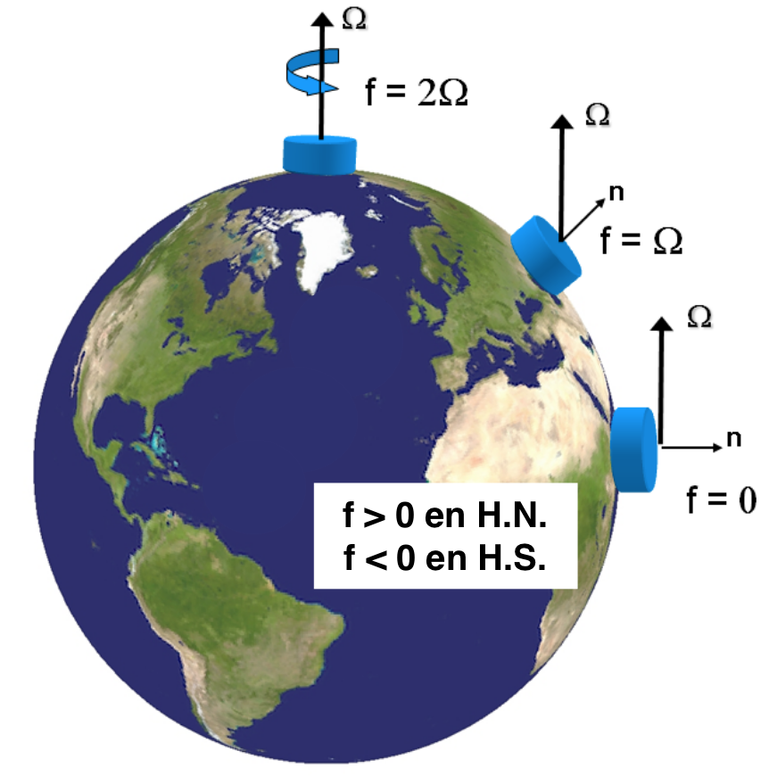 $\Omega=7.2921\times10^{-5}$ rad s$^{-1}$

:::

::: {.column width="60%"}

Agrega el término $2\vec{\Omega} \times \vec{u}$ a las ecuaciones de momento.

Flujos tienden a desviarse a la **derecha** en el **hemisferio norte** y a la izquierda en el hemisferio sur.

**Parámetro de Coriolis**   $$f=2\Omega\sin{\varphi},$$ donde $\varphi$ es la latitud.

Por ejemplo: 

En Huatulco ($\varphi=17.09^{\circ}$ N), $f=4.28\times10^{-5}$ s$^{-1}$

En Ensenada ($\varphi=30.90^{\circ}$ N), $f=7.47\times10^{-5}$ s$^{-1}$

:::

::::

## Efecto de la rotación{.smaller}

Para que el flujo sienta el efecto de la rotación, las escalas temporales deben ser del orden de un periodo de rotación.

$$
\epsilon = \frac{\textrm{tiempo de una revolución}}{\textrm{tiempo en avanzar } L \textrm{ a velocidad } U}
$$
$$= \frac{\frac{2\pi}{\Omega}}{\frac{L}{U}} = \frac{2\pi U}{\Omega L}.$$ 

Si **$\epsilon \le 1$, la rotación es importante**. Esto limita el tamaño y velocidad del flujo y nos da una definición de "gran escala".

Nombre especial de $\epsilon$: *Número de Rossby* en forma $Ro=U/fL$.

## Similaridad dinámica {.smaller}

¿Por qué podemos estudiar la atmósfera, el océano y un tanque con las mismas ecuaciones?

$$\frac{\partial\vec{u}}{\partial t}+ \vec{u}\cdot\nabla\vec{u} + \vec{f}\times\vec{u} = \frac{1}{\rho} \nabla P - \vec{g} + \mu \nabla^2\vec{u}$$

Ej. Para que la rotación importe, $Ro=U/fL<1$:

**Tierra** $f$ ~ $10^{-4}$ s$^{-1}$

*Océano*: $L\sim10^3$ km, $U\sim10$ cm s$^{-1}$, $Ro\sim10^{-2}$

*Atmósfera*: $L\sim10^4$ km, $U\sim10$ ms$^{-1}$, $Ro\sim10^{-3}$

**Plataforma giratoria** $f$ ~ $10^{-1}$ s$^{-1}$

*Laboratorio*: $L\sim1$ m, $U\sim10^{-2}$ cm s$^{-1}$, $Ro\sim10^{-1}$

## Similaridad dinámica {.smaller}

Para que dos flujos sean **físicamente equivalentes** o análogos deben tener **similaridad dinámica** (cinemática y geométrica).

La importancia relativa entre distintos tipos de fuerza (e.g., inerciales, viscosas, etc.) debe ser la misma para ambos flujos.

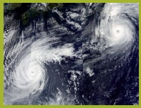
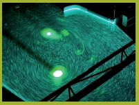

::: aside
Interacción de remolinos cerca de Japón y remolinos en el laboratorio - LEGI Plataforma Coriolis (J.B. Flor, 2005). Imágenes tomadas de http://www.legi.grenoble-inp.fr/web/spip.php?article757.
:::

## Habrá similaridad dinámica si...{.smaller}

...los **grupos adimensionales** de ambos flujos son **iguales**.

Algunos ejemplos de números adimensionales relevantes:

::::{.columns}

:::{.column width="30%"}

**Rossby** 

rotación vs. advección 

$Ro=\frac{U}{fL}$

:::

:::{.column width="30%"}

**Burger** 

rotación vs. estratificación 

$Bu=\frac{NH}{fL}$

:::

:::{.column width="30%"}

**Reynolds** 

inerciales  vs.  fricción 

$Re=\frac{UL}{\nu\_E}$

:::

::::
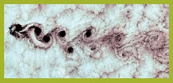
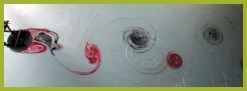

::: aside
Vórtices de von Kárman sobre la isla de Selkirk y experimento análogo de A. Stegner (2005). Imágenes tomadas de [http://www.legi.grenoble-inp.fr].
:::

---

## DFG en el laboratorio {.smaller}

:::: {.columns}

::: {.column width="60%"}

**Rotación**: Plataforma o mesa giratoria

**Estratificación**: Distintas concentraciones de sal o gradientes de temperatura

**Medio**: Usamos agua en vez de aire para modelar tanto océano como atmósfera (nunca he visto un túnel de viento giratorio, pero ¿tal vez sí hay?).
:::

::: {.column width="40%"}

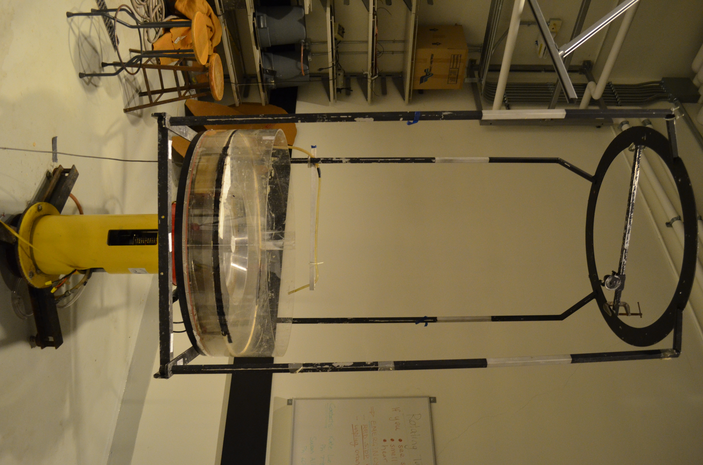

:::

::::

::: aside
Mesa giratoria del Laboratorio de Fluidos Geofísicos, UBC
:::

## DFG con simulaciones numéricas {.smaller}

En general discretizamos el dominio de interés y las ecuaciones de movimiento y termodinámica usando diferencias finitas o volumen finito (entre otras).

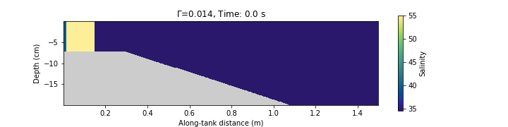

::: aside

Simulación de una corriente de gravedad a escala de laboratorio usando el modelo MITgcm.

:::
##

La **DFG** se trata de **representar matemáticamente** e **interpretar físicamente** el movimiento de flujos geofísicos.

Las matemáticas de la DFG son muy "computacionales" (Ej. modelación numérica de la circulación oceánica y las nubes son los problemas computacionales más grandes en la historia de la ciencia)

Esto se debe a que los experimentos de laboratorio solo pueden responder algunas de las preguntas interesantes.

En geofísica muchos de los avances teóricos están basados en DFG y no en experimentos porque obtener mediciones en campo es complicado, caro y muchas veces imposible.

## ¿Por qué estudiar dinámica del oceáno? 

Los océanos son el motor del clima y los sistemas meteorológicos de la Tierra.
  

Entender la dinámica oceánica ayuda a:

  - Predecir corrientes y ondas en el océano.
  - Gestionar pesquerías y ecosistemas.
  - Mitigar los impactos del cambio climático.

## Geostrofía: El Balance de Fuerzas {.smaller}

### Concepto
- Balance entre la **fuerza de Coriolis** y el **gradiente de presión**.
- Genera corrientes a gran escala.
- Giros ciclónicos o anticiclónicos, diámetro típicamente entre 50–200 km, importantes en el transporte de calor y nutrientes.

### Ejemplo de la Vida Real
 **Remolinos de la Corriente del Lazo**

##

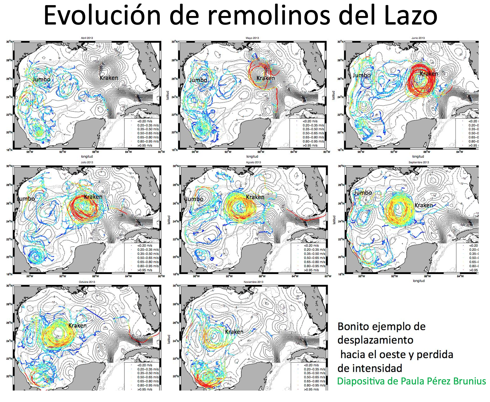

  
## Oscilaciones Inerciales {.smaller}

::::{.columns}

:::{.column width="40%"}

**Concepto**
- Movimientos circulares de partículas de agua debido a la fuerza de Coriolis, sin fuerzas restauradoras.

**Ejemplo de la Vida Real**

- **Respuesta a Ciclones en el Golfo de México**:
-Tras eventos como huracanes la capa superficial oscila en sentido de las manecillas del reloj.
- Esta energía puede progagarse al interior en el borde de remolinos o en la corriente del Lazo.
:::

:::{.column width="60%"}

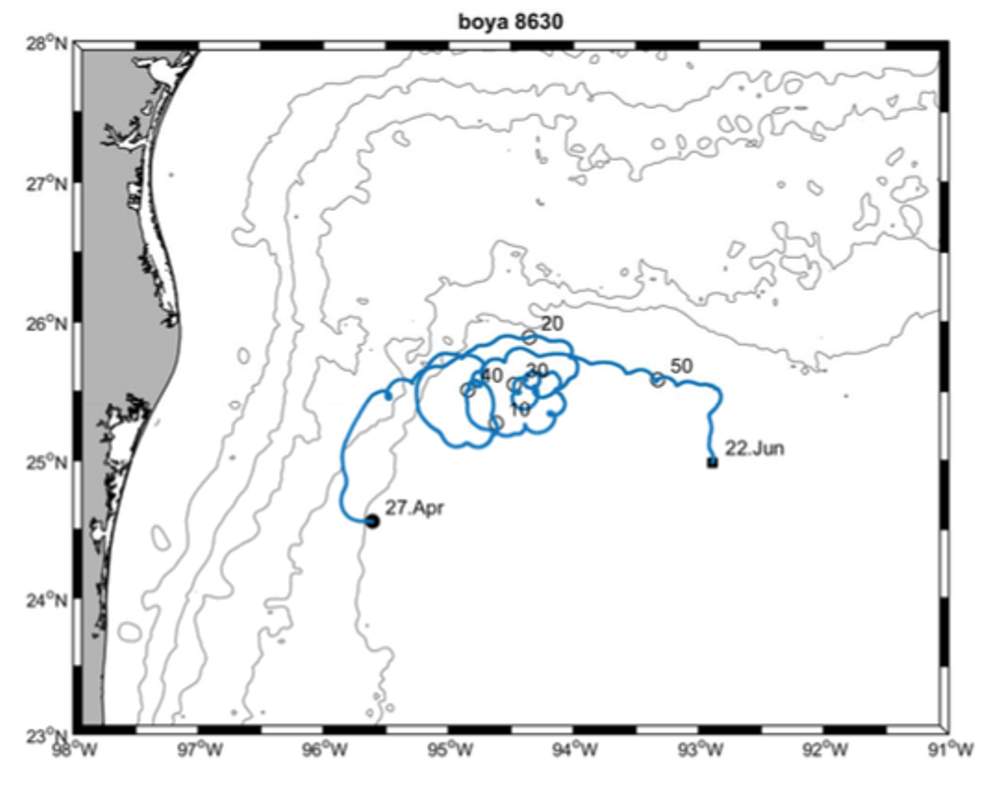

:::
::::
##

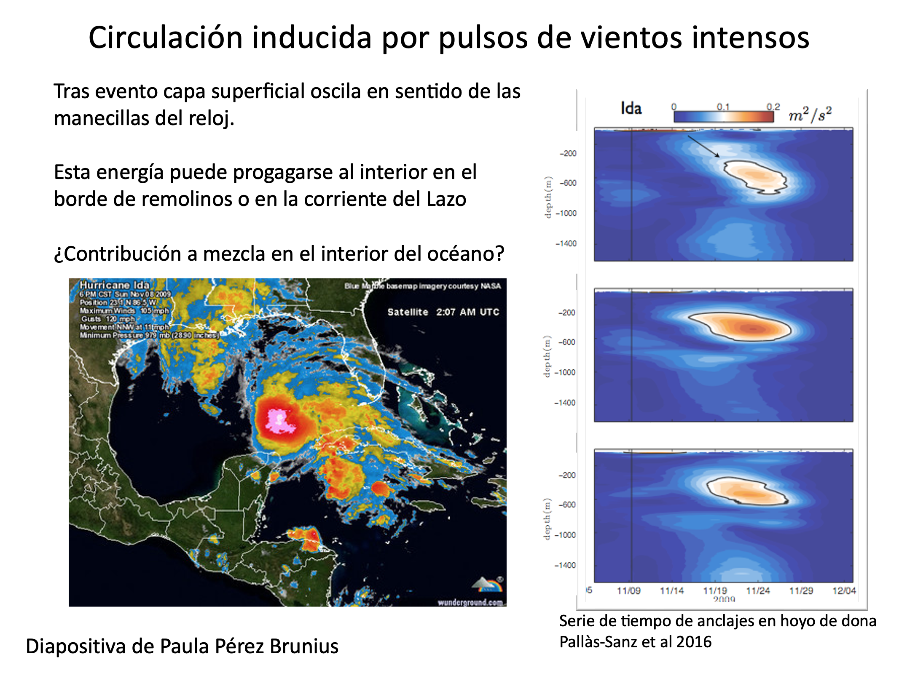

## Ondas de Kelvin: Mensajeras Costeras {.smaller}

**Concepto**

- Ondas no dispersivas atrapadas a la costa o al ecuador debido a la rotación de la Tierra.

**Ejemplo de la Vida Real**
- **El Niño y el Pacífico Mexicano**:
  - Las ondas de Kelvin suprimen la termoclina propiciando la aparición de aguas anómalamente cálidas en las costas del Pacífico durante eventos de El Niño, afectando la pesca y provocando lluvias intensas en México.

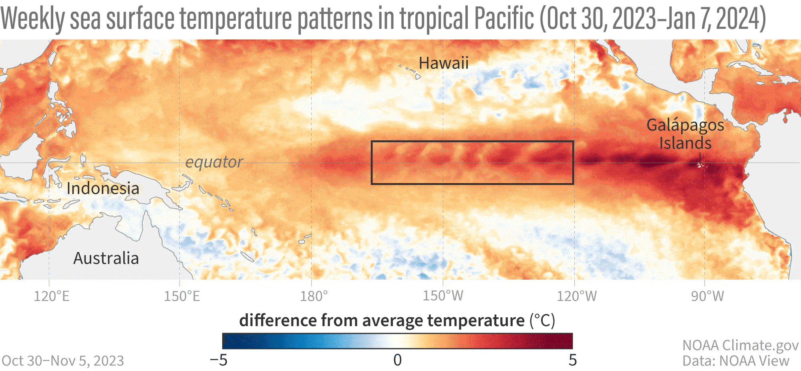

##

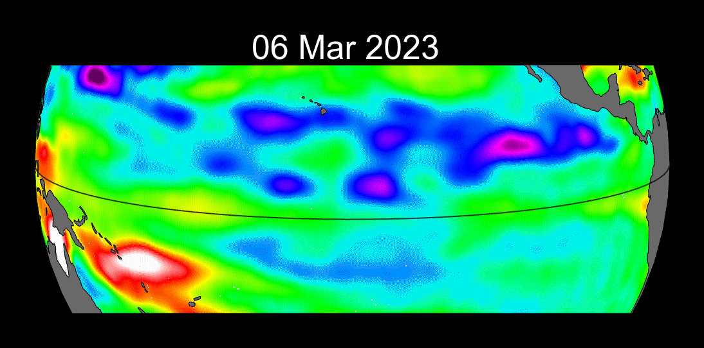

::: aside
Animaciones de NOAA climate y [NASA JPL](https://sealevel.jpl.nasa.gov/data/el-nino-la-nina-watch-and-pdo/el-nino-2023/)
:::

## Ondas Internas {.smaller}

**Concepto**

- Ondas que se propagan dentro del océano debidas a los cambios de densidad en el océano.

** Ejemplo de la Vida Real**

- **Ondas Internas en el Golfo de California**:
  - Generadas por la interacción de las mareas con la topografía submarina, contribuyen al transporte de nutrientes hacia la superficie y sostienen pesquerías como la sardina y el camarón.

##

Animación de MIT ondas internas en el estrecho de Luzón (mar del Sur de China)
<iframe width=884 height="500" src="https://www.youtube-nocookie.com/embed/WYmRnSRsS7Y?si=DCwffbYB9Np08Izl" title="YouTube video player" frameborder="0" allow="accelerometer; autoplay; clipboard-write; encrypted-media; gyroscope; picture-in-picture; web-share" referrerpolicy="strict-origin-when-cross-origin" allowfullscreen></iframe>

##

Experimento en la Universidad de Washington:
<iframe width="884" height="500" src="https://www.youtube-nocookie.com/embed/BDQD_gM3M24?si=5Hh66mg7FJ9A0FAs&amp;start=84" title="YouTube video player" frameborder="0" allow="accelerometer; autoplay; clipboard-write; encrypted-media; gyroscope; picture-in-picture; web-share" referrerpolicy="strict-origin-when-cross-origin" allowfullscreen></iframe>

## Consecuencias sociales {.smaller .scrollable}

  La dinámica del oceáno es central para resolver los desafíos globales actuales.

**Corrientes Geostróficas**: Redistribuyen el calor entre el ecuador y los polos.

  - Estabilizan las temperaturas globales.
  - Influyen en climas regionales, por ejemplo, los inviernos suaves en Europa debido a la Corriente del Golfo.

**Oscilaciones Inerciales**: Ofrecen información sobre la redistribución de energía tras huracanes.

  - Predicción de erosión costera y daños en infraestructura.
  - Apoyo en la recuperación post-desastre.

**Ondas Internas**: Potencial de llevar nutrientes desde las capas profundas a la superficie.

  - Sostienen pesquerías y ecosistemas marinos.

**Remolinos de Mesoscala**: Pueden influir en la mezcla vertical

 - Secuestro de carbono.
 - Redistribución de calor y nutrientes.

**Dinámica Oceánica en Modelos Climáticos**: 

 - Simular con precisión intercambios de calor, el aumento del nivel del mar y los retroalimentación climática.
 - Orientar políticas climáticas internacionales (e.g., Acuerdo de París).

## Sus Perspectivas 
1. ¿Cómo puede el entendimiento de la dinámica oceánica ayudar a nuestra comunidad localmente?
2. ¿Qué tema te emociona más? ¿Por qué?

# Referencias

Cushman-Roisin y Beckers - Capítulos 1 y 11.     
