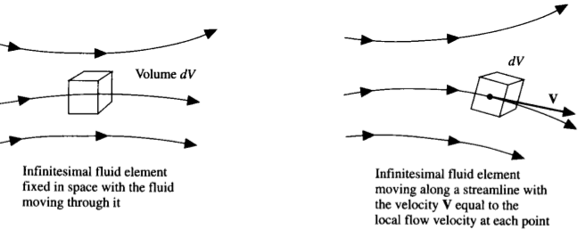
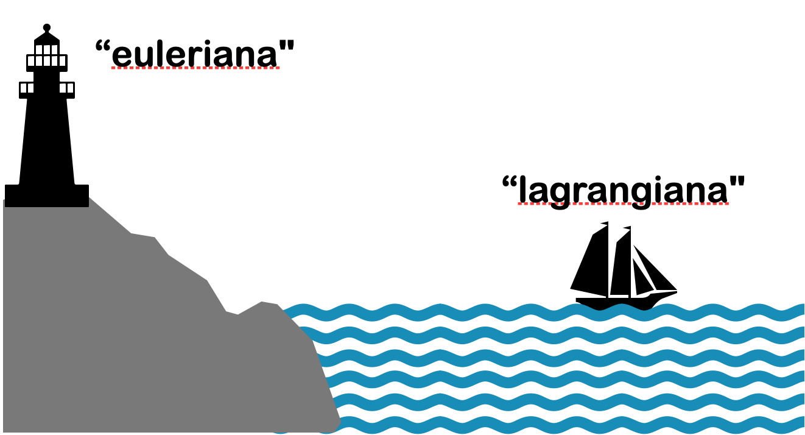
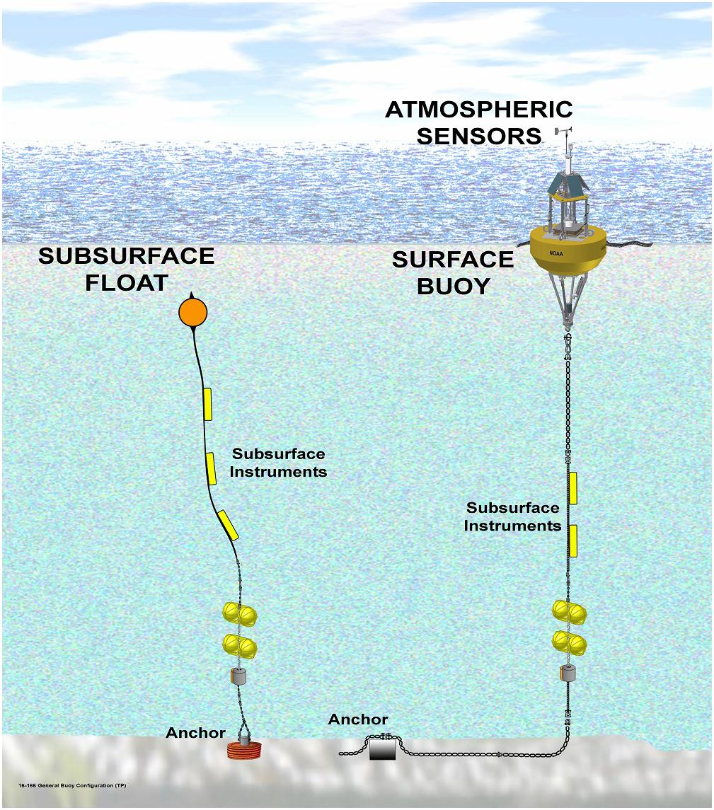
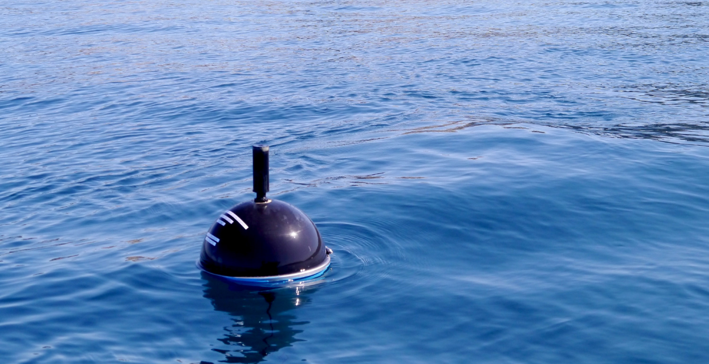
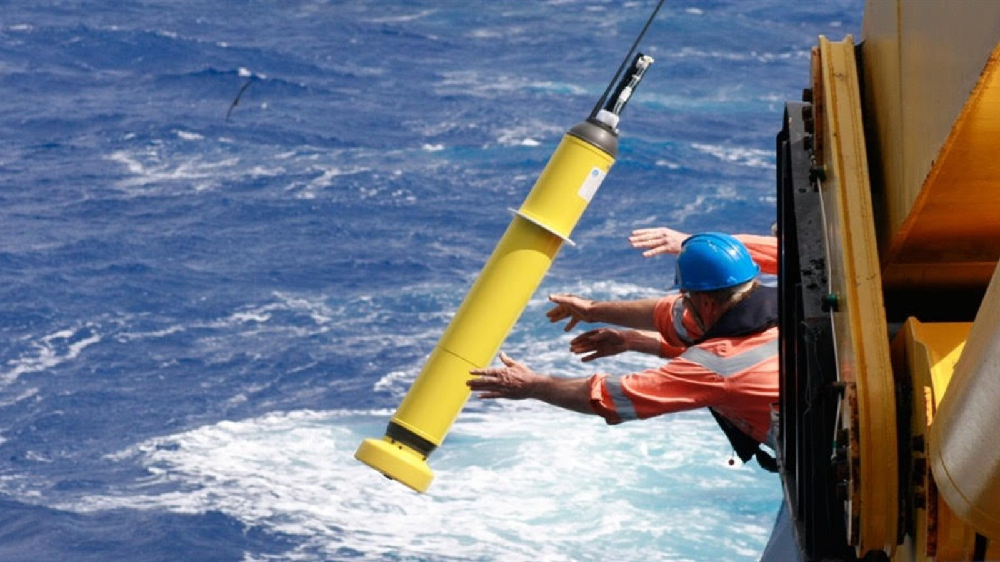
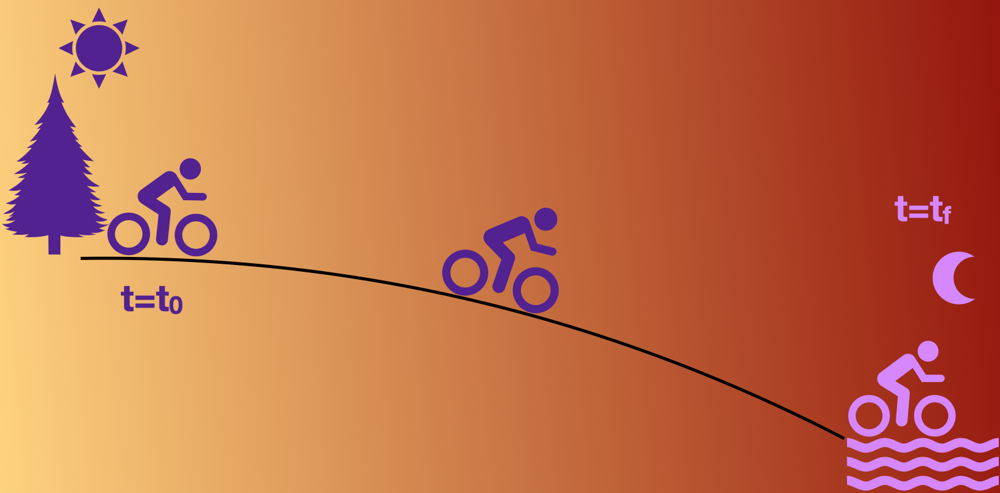
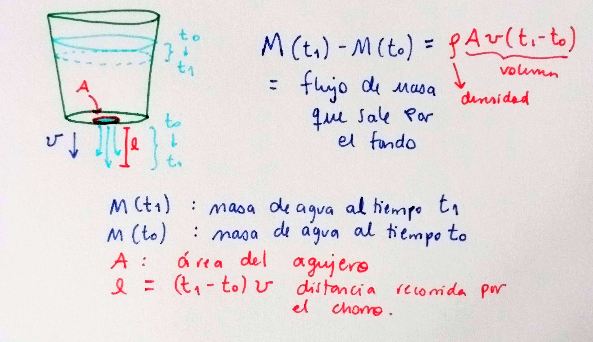
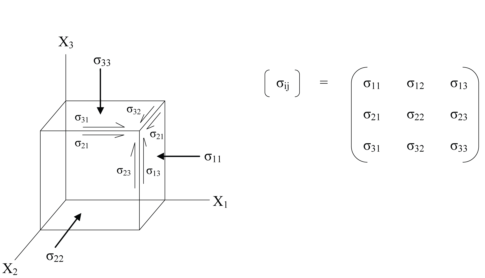

       
#  Repaso
Clase pasada

# Cinemática

##  Elemento de fluido {.smaller}

Es un pedazo o porción arbitrariamente pequeña del continuo que nos facilita entender cómo se comporta un fluido. Es una construcción conceptual, no física, en la que asumimos que:

3. su volumen es tan pequeño que sus propiedades son uniformes;
2. tiene masa constante (usualmente);
1. se mueve bajo la influencia del fluido que lo rodea.

##  Cinemática: ¿Cómo vamos a describir al fluido? {.smaller}

Describir el movimiento de un objeto pequeño, como una piedra, es relativamente sencillo. Podemos seguir la trayectoria del centro de masa como una función $\vec{x}=\vec{x}(t)$ y relacionar las fuerzas que actúan sobre la piedra con la velocidad y aceleración a partir de nuestro conocimiento de $\vec{x}(t)$. 

La descripción de un fluido no es tan simple. El fluido está en todos lados. No nos interesa la trayectoria del centro de masas sino el movimiento del continuo, constituido por una inifindad de elementos de fluido.

En general hay dos métodos útiles:

**Descripción euleriana**

**Descripción lagrangiana** 

## Analogía entre descripciones

##  Descripción euleriana{.smaller}
:::: {.columns}

::: {.column width="50%"}
Fluido en espacio 3D y tiempo. Podemos describir una propiedad $P$ como función del vector de posición $\vec{x} = (x, y, z)$ y el tiempo, $P=P(\vec{x},t)$.

Descripción de P en cada punto y para cada tiempo sin especificar qué elemento de fluido ocupa qué posición a un tiempo dado^[E.g. Ve a [nvs.nanoos.org](http://nvs.nanoos.org/) para ver ejemplos de series de tiempo de "plataformas fijas".].

* Anemómetro fijo
* Corrientímetro
:::

:::{.column width=50%}

:::

::::

##  Descripción lagrangiana {.smaller}
:::: .columns

:::{.column width=50%}
"Monitorea" elementos de fluido individuales y especifica las propiedades con respecto a cada elemento.

Descripción del flujo siguiendo a cada partícula de fluido.

Ejemplos de mediciones lagrangianas:

* Drifters o flotadores en el océano^[Por ejemplo: Derivadores del Lagrangian Drifter Lab del Global Drifter Program de NOAA [en vivo](https://gdp.ucsd.edu/apps/projects/noaa/global-drifter-program.html) y ARGO floats (Imagen de Commonwealth Scientific and Industrial Research Organisation (CSIRO))]
:::

:::{.column width=40%}
 
 

:::
::::
##  Tasas de cambio{.smaller}
 Imagina que viajas de Cuernavaca al Puerto de Veracruz en bicicleta. En el camino notarás un cambio de temperatura. Esto puede ser debido a que la temperatura cambió en el tiempo (hora del día, fenómeno meteorológico, etc.) o a que atravesamos un gradiente espacial de temperatura (altitud, vegetación, etc.).

 Veremos 3 nociones de tasa de cambio:

 1. Cambio temporal local (tasa de cambio en un punto fijo),
 2. tasa de cambio de un observador en movimiento y
 3. tasa de cambio de un elemento de fluido dentro del flujo. 

## Tasa de cambio local {.smaller}
Definimos la tasa de cambio de una propiedad $P$ con respecto al tiempo en un punto fijo $\vec{x}$ como:

$$\textrm{Derivada temporal local} = {\frac{\partial P}{\partial t}}\Big|_{\vec{x}}$$

Regularmente omitimos el subíndice $\vec{x}$. Podemos ver esto como el cambio de $P$ conforme una serie de elementos de fluido pasan por el punto $\vec{x}$.

## Tasa de cambio de un observador en movimiento

Volvamos a la ciclista viajando a Veracruz. Digamos que se mueve a velocidad $\vec{v}=(v_1,v_2,v_3)$ distinta al fluido (aire), de manera que para ella $\vec{v}=d\vec{x}/dt$.

El cambio **total** en la propiedad $P$ medido por la ciclista es:

$$\frac{dP}{dt}=\frac{\partial P}{\partial t} + \frac{\partial P}{\partial x}\frac{dx}{dt} + \frac{\partial P}{\partial y}\frac{dy}{dt} + \frac{\partial P}{\partial z}\frac{dz}{dt}$$

$$\frac{dP}{dt}=\frac{\partial P}{\partial t}+\vec{v}\cdot\nabla P$$

## Ejemplo: 
Tasa de cambio de la altura sobre el piso de una niña que baja por una resbaladilla.

## Tasa de cambio de un elemento de fluido dentro del flujo

El "observador" ahora es el mismo flujo, que se mueve con la misma velocidad que el fluido, $\vec{u}$. La tasa de cambio es simplemente la tasa de cambio de la propiedad $P$ del propio elemento de fluido:

$$\frac{DP}{Dt}=\frac{\partial P}{\partial t}+\vec{u}\cdot\nabla P.$$

A esta tasa de cambio se le conoce como *derivada material* o *derivada total*.

## Ejemplo:

Propiedad cuya distribución está dada por $P=P_0\cos{\omega t}\sin{kx}$, donde $\omega=2\pi/T$ es la frecuencia de la onda y $k=2\pi/\lambda_x$ es el número de onda en dirección $x$. Supongamos que el flujo es únicamente en dirección $x$ con magnitud $U$.

(pizarrón) 

    
#  Conservación de masa

Intuitivamente:

Cambio en la masa dentro de la cubeta es igual a la masa de agua que sale de la cubeta.

Vamos a las notas (derivación conservación de masa)

#  Ecuación de conservación de masa

$$\frac{D\rho}{Dt}+\rho\nabla\cdot\vec{u}=0$$

El cambio local en la masa dentro de un volumen de control se compensa con la divergencia local del flujo de masa en el volumen.

En un *fluido incompresible* $\rho$ es constante, por lo que $D\rho/ Dt=0$ y la ecuación de continuidad queda como:  $$\nabla\cdot\vec{u}=0.$$

#  Ecuación de conservación de momento

Expresión de la segunda ley de newton para un fluido $$F=d\vec{p}/dt\approx m\vec{a}.$$

**Fuerzas en un fluido:**

* de cuerpo: Actúan directamente sobre la masa del elemento y se distribuyen sobre todo el volúmen. Ej. gravitacional, electromagnética (si el fluido es conductor). $$\vec{F}_{cuerpo} = m\vec{g} = \int_V dV\rho\vec g$$

**Fuerzas en un fluido:**

* de superficie: Actúan sobre la superfice, son direccionales. Ej. presión, esfuerzos cortantes.

Tensor de esfuerzos: elementos en la diagonal, **presión**; fuera de la diagonal, **esfuerzos cortantes**

$$\vec{F}_{superficie}=\int_S[\sigma]\cdot\hat{n}dS$$.

Vamos a las notas (derivación consevación de momento)

## Ecuación de conservación de momento

$$\rho\frac{D\vec{u}}{Dt}=\rho \vec{g} + \nabla\cdot[\sigma]$$

Esta expresión es cierta para cualquier fluido. ¡La física está guardada en el tensor de esfuerzos! 

**Relaciones constitutivas**

Los esfuerzos $[\sigma_{ij}]$ son una combinación de presión $p$ y fricción viscosa:

$$\sigma_{ii} = -p + \lambda \nabla \cdot \vec{v} + 2\mu\frac{\partial{u_i}}{\partial{x_i}}$$

$$\sigma_{ij} = \mu\Big(\frac{\partial u_i}{\partial{x_j}}+\frac{\partial u_j}{\partial{x_i}}\Big)$$

## **Relaciones constitutivas**

Los esfuerzos $[\sigma_{ij}]$ son una combinación de presión $p$ y fricción viscosa:

$$\sigma_{ii} = -p + \lambda \nabla \cdot \vec{v} + 2\mu\frac{\partial{u_i}}{\partial{x_i}}$$

$$\sigma_{ij} = \mu\Big(\frac{\partial u_i}{\partial{x_j}}+\frac{\partial u_j}{\partial{x_i}}\Big)$$

$\lambda$ y $\mu$ son los coeficientes de viscosidad dinámica y estática, respectivamente.

ASUMIENDO que la **relación entre esfuerzo y gradientes de velocidad es lineal** (fluido Newtoniano) e **isotrópica** (las propiedades intrínsecas del fluido no tienen dirección preferencial).

# Referencias
 
Notas de clase de Prof. Stephanie Waterman (UBC) y Prof. Suzanne Fielding (Durham).

