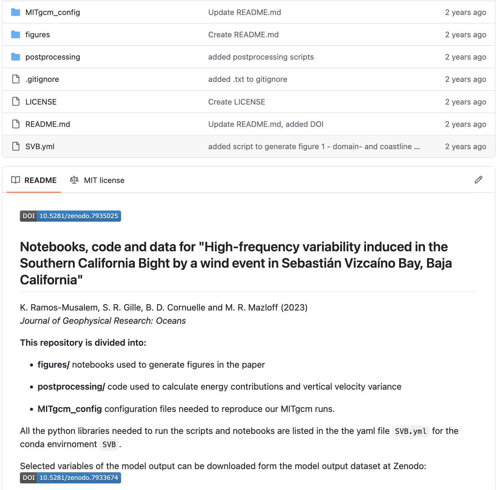
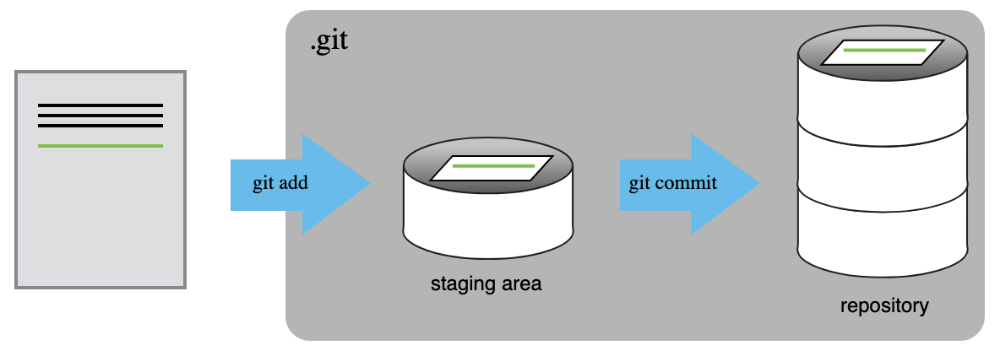
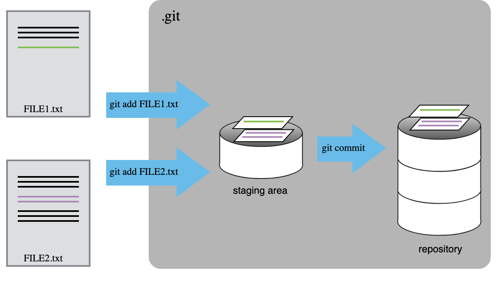
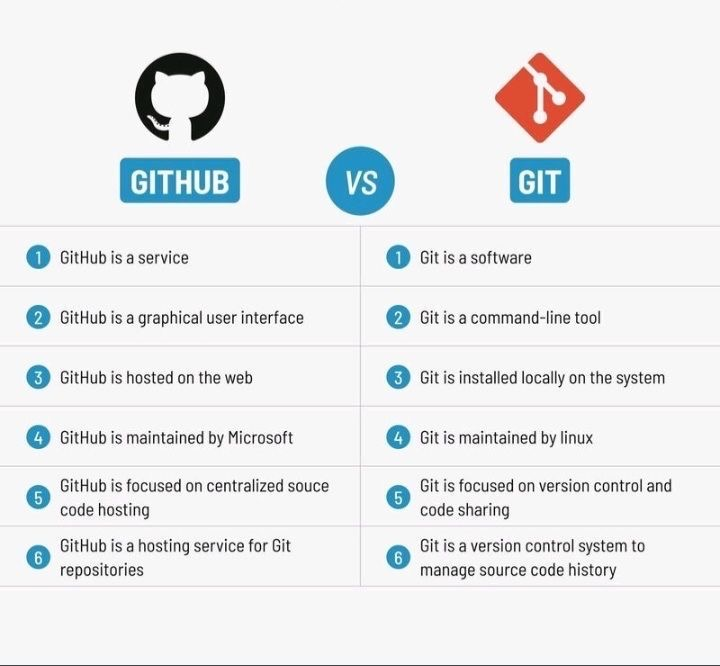

# Introducción


## ¿Cuándo debo usar control de versiones? Un ejemplo {.smaller .scrollable}

| Aspecto                 | **Código del artículo** (control de versiones: Git)                                 | **Manuscrito del artículo** (control de cambios: Word)                   |
| ----------------------- | ----------------------------------------------------------------------------------- | ------------------------------------------------------------------------------------ |
| Objetivo                | Reproducir análisis/figuras con historial confiable                                 | Pulir redacción, estructura y estilo del texto                                       |
| Formato típico          | Texto simple (R/Python/Julia, Markdown, LaTeX)                                      | DOCX o Google Docs con formato y figuras                                 |
| Unidad de cambios       | *Commits* con mensajes (pequeños)                                                   | Sugerencias/comentarios sobre frases y párrafos                                      |
| Flujo de trabajo        | Ramas para features/experimentos; *pull requests*                                   | Revisión editorial; aceptar/rechazar sugerencias                                     |
| Incorporar cambios      | **Merges** para mezclar trabajo paralelo; resolución de conflictos en archivos      | Manual; se complica con muchos editores simultáneos                           |
| Revertir                | Volver a cualquier commit/etiqueta; *revert* selectivo                              | Restaurar versión del documento solo si salvamos                               |
| Reproducibilidad        | Alto: *environment files*, *scripts* y *pipelines* versionados                      | El texto describe métodos; no garantiza ejecución                             |
| Responsabilidad         | Quién cambió qué archivo/línea y por qué (mensaje)                                  | Quién propuso qué edición textual y cuándo                                           |
| Mejor para              | Experimentos, notebooks, scripts, plantillas LaTeX                                  | Introducción, discusión, respuesta a revisores                |
| Entregables             | Repo con README, instrucciones y *environment*                                      | Manuscrito formateado según la revista                                               |
| Momento ideal de uso    | Desde el inicio del proyecto hasta la aceptación                                    | Borradores medios y finales                         |

## Ejemplos de uso (Git + GitHub){.smaller}

:::: {.columns}

:::{.column width="50%"}
[](https://github.com/anakarinarm/SVB_highFreqVar_paper)
Repositorios con DOI (Releases) 
:::

:::{.column width="50%"}
[](https://github.com/SalishSeaCast/tools/tree/main/SalishSeaTools/salishsea_tools)
Herramientas compartidas dentro y entre grupos - SalishSeaCast
:::
::::

# Configurando Git
## Configuración global {.smaller}

  ```$ git config --global user.name "Alfredo Linguini"```
  
  ```$ git config --global user.email "a.linguini@ratatouille.fr"```

. . . 

Editor de texto (hay muchas opciones)

  ```$ git config --global core.editor "nano -w"```

. . . 

Nombre de la rama default

  ```git config --global init.defaultBranch main```

. . .

Sugerido Linux/Mac:

  ```$ git config --global core.autocrlf input ```

Windows:

  ```$ git config --global core.autocrlf true```

. . . 

Revisemos Configuración

```git config --list --global```


# Rastreando cambios
## Agregar cambios con *add* {.smaller}


Imagen: Software Carpentry

## Comprometer cambios con *commit* {.smaller}


Imagen: Software Carpentry

## Por qué hacer *add* antes de *commit*? {.smaller}


## Reto 1 {.smaller}

Haciendo Commit de Cambios a Git

¿Cuál de los siguientes comandos debería guardar los cambios de ```myfile.txt``` a mi repositorio local Git?
   
  ```git commit -m "my recent changes"```

  ```git init myfile.txt $ git commit -m "my recent changes"```

  ```git add myfile.txt $ git commit -m "my recent changes"```

  ```git commit -m myfile.txt "my recent changes"```  

## Reto 2 {.smaller}


Haciendo Commit a Multiples Archivos

El staging area puede tener cambios de cualquier número de archivos a los que quieras hacer commit, como una sola foto.

  1. Agrega algún ingrediente a guacamole.md.
  
  2. Crea un nuevo archivo guacamole_secreto.md con tus ideas para una nueva recea de guacamole.
    
  3. Agrega los cambios de ambos archivos al staging area, y haz un commit de esos cambios.

## Reto 3 {.smaller}

1. Crea un nuevo repositorio Git en tu computadora, llamado bio.
2. Escribe una autobiografía de tres líneas en un archivo llamado me.txt, haz commit de tus cambios
3. Modifica una línea, agrega una cuarta línea
4. Muestra las diferencias entre el estado actualizado y el original

# Revertir cambios

## Reto 4. {.smaller}

Cuál es el output al final de los siguientes comandos?

    $ cd recipes
    
    $ echo "I like tomatoes, therefore I like ketchup" > ketchup.md
    
    $ git add ketchup.md
    
    $ echo "ketchup enhances pasta dishes" >> ketchup.md
    
    $ git commit -m "My opinions about the red sauce"
    
    $ git restore ketchup.md
    
    $ cat ketchup.md # this will print the content of ketchup.md on screen

. . . 

Respuesta: I like tomatoes, therefore I like ketchup

# Ignorando cosas {.smaller}


# Repositorios remotos {.smaller}

Imagen: Data science dojo

