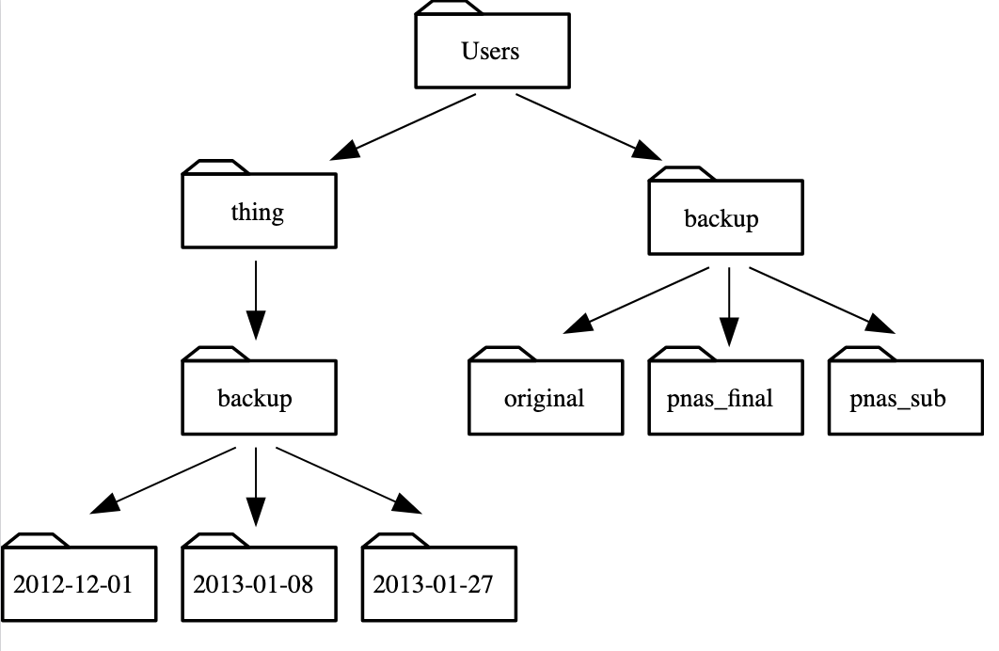

## Repaso. `ls` comprensión de lectura

Suponiendo una estructura de directorio como en la figura anterior, si pwd muestra /Users/backup, y -r le dice a ls que muestre el resultado en orden inverso, ¿qué comando mostrará:
SALIDA

pnas_sub/ pnas_final/ original/

    ls pwd
    ls -r -F
    ls -r -F /Users/backup
    #2 y #3, pero no #1.
