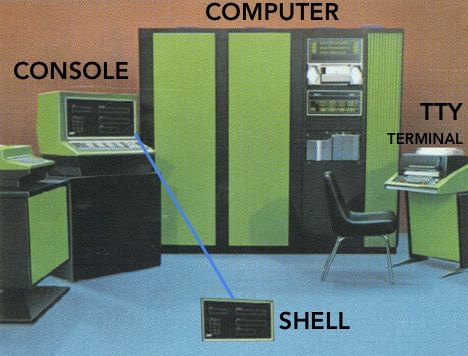
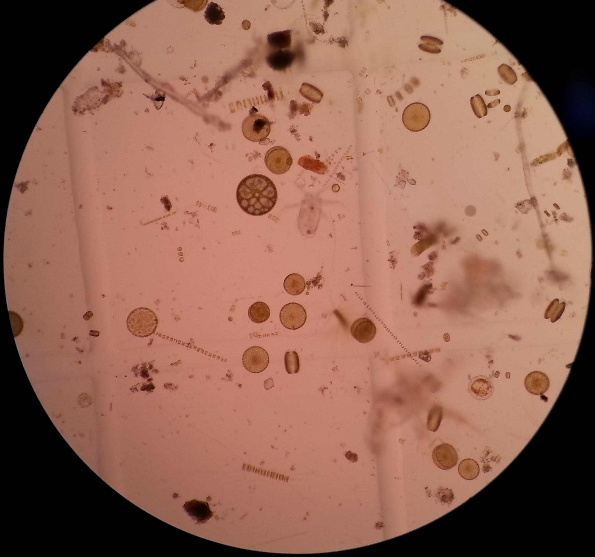
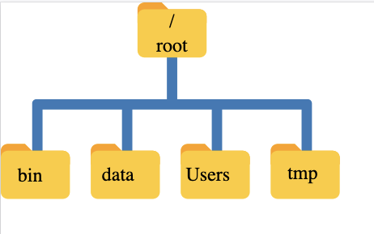
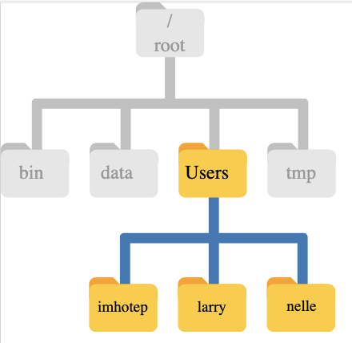
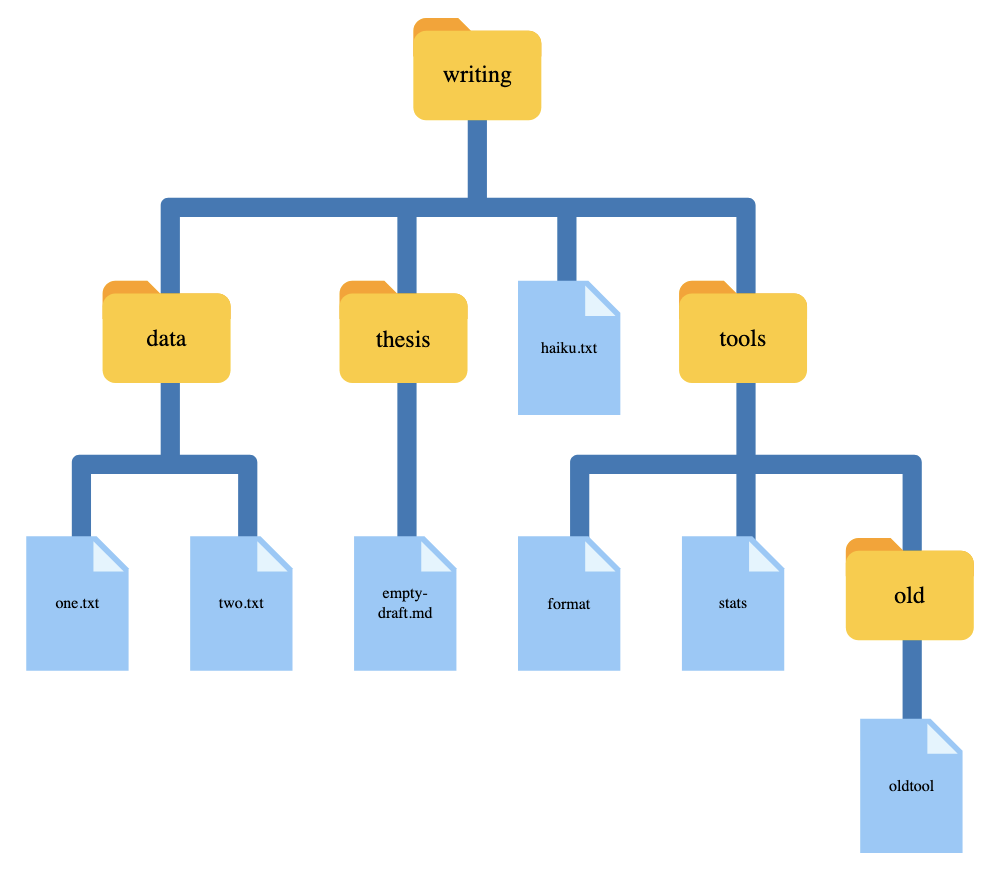

# Introducción

## Un poquito de historia de la terminal {.smaller .scrollable}

:::: {.columns}

:::{.column width="60%"}

Las computadoras realizan cuatro funciones básicas:
  
  * Ejecutar programas
  * Guardar datos
  * Comunicarse entre ellas
  * Interactuar con nosotros


**Interfaces**: desde conexiones cerebro-computadora y voz → hasta pantallas, ratones, teclados.

Las **interfaces gráficas (GUI)** son comunes desde los 80s; origen en los 60s con Doug Engelbart y “La Madre de todos los Demos”.

:::

::: {.column width="40%"}


*Imagen de [ss64.com/bash/syntax-terminal.html](https://ss64.com/bash/syntax-terminal.html)*

Más info en: [unixdigest](https://unixdigest.com/articles/the-terminal-the-console-and-the-shell-what-are-they.html)
:::

::::

Antes de la GUI → solo existía la interfaz de **línea de comandos** (CLI).

Entrada/salida limitada a texto (teclado estándar, impresoras de línea).

Basada en el ciclo REPL: leer (read) → ejecutar (execute) → imprimir (print) → repetir (loop).

## La terminal y su utilidad {.smaller}

**Terminal** (shell): programa intermediario entre usuario y sistema operativo.

Ejecuta otros programas en lugar de hacer cálculos directamente.

Ejemplo popular: **Bash** (Bourne Again Shell) en Unix/Linux.

Ventajas del uso de la terminal (CLI):

  * Comodidad para programar: comandos cortos y rápidos.
  * Permite combinar herramientas en pipelines.
  * Automatización de tareas → productividad y reproducibilidad.
  * Interacción sencilla con máquinas remotas y supercomputadores.

¡Es una habilidad clave en computación científica, clusters y la nube!

# Motivación 

## El caso de Nelle {.smaller}

:::: {.columns}

:::{.column width="30%"}

:::

::: {.column width="70%"}
Oceanógrafa biológica, ha recolectado 1,520 muestras de vida marina gelatinosa en el Giro del Pacífico Norte.

Ahora debe:

  * Procesar cada muestra en máquina de ensayo → 300 proteínas por muestra.
  * Calcular estadísticas con `goostat`.
  * Comparar estadísticas con `goodiff`.
  * Resumir resultados para un artículo en *Aquatic Goo Letters*.
:::

::::
Peeero,

    * Ensayo: 30 min/muestra, 8 máquinas en paralelo → ~2 semanas.
    * Procesamiento manual: 46,370 ejecuciones (≈2+ semanas sin pausa).
    * Riesgo de errores y retraso en la entrega.

Solución: **¡¡¡Automatización con línea de comandos!!!**

## El caso de Gala {.smaller}

:::: {.columns}

::: {.column width="60%"}
Técnica de proyecto que debe correr un modelo oceánico, pero en su computadora tardaría mucho así que debe usar una supercomputadora o cluster.

- ¡No hay interfaz gráfica (GUI)! 
  
    --> Debe poder comunicarse con la supercomputadora para configurar y correr el modelo, analizar las salidas y graficarlas por medio de la terminal.
:::

::: {.column width="40%"}

*Imagen de [MPAS-Ocean](https://mpas-dev.github.io/ocean/ocean.html)*
:::

::::

# Navegación

  ¿Cómo puedo moverme dentro de mi computadora?
  
  ¿Cómo puedo ver qué archivos y directorios tengo?
  
  ¿Cómo puedo especificar la ubicación de un archivo o directorio en mi computadora?

## Sistema de archivos

:::: {.columns}

::: {.column width="50%"}


Sistema de archivos de Nelle.
:::

::: {.column width="50%"}


Directorio `/home` de Nelle.
:::

::::


## Reto 1. Rutas Absolutas vs Relativas

A partir de `/Users/amanda/data/`, ¿Cuál de los siguientes comandos podría Amanda usar para navegar a su directorio de inicio, que es `/Users/amanda`?

    1. cd .
    2. cd /
    3. cd /home/amanda
    4. cd ../..
    5. cd ~
    6. cd home
    7. cd ~/data/..
    8. cd
    9. cd ..

. . . 

Solución: 5, 7, 8, 9

## Reto 2. Resuelve la ruta relativa

Si se utiliza el diagrama de sistema de directorios y `pwd` muestra `/Users/thing`, ¿Qué mostrará `ls -F ../backup`?

:::: {.columns}

::: {.column width="50%"}
    
    1. ../backup: No such file or directory
    
    2. 2012-12-01 2013-01-08 2013-01-27
    
    3. 2012-12-01/ 2013-01-08/ 2013-01-27/
    
    4. original/ pnas_final/ pnas_sub/
:::

::: {.column width="50%"}

:::

::::

. . . 

Solución: 4. `original/ pnas_final/ pnas_sub/`

## En corto {.smaller .scrollable}

  - El sistema de archivos es responsable de administrar la información en el disco.
  - `cd path` cambia el directorio de trabajo actual.
  - `ls path` imprime un listado de un archivo o directorio específico; `ls` por si solo lista el contenido del directorio de trabajo actual.
  - `pwd` imprime el directorio de trabajo actual del usuario.
  - `whoami` muestra la identidad actual del usuario.
  -  `/` es el directorio raíz de todo el sistema de archivos.
  - Una **ruta relativa** especifica una ubicación desde la ubicación actual.
  - Una **ruta absoluta** especifica una ubicación desde la raíz del sistema de archivos.
  - Los nombres de directorio en una ruta están separados por `/` en Unix y por `\` en Windows.
  - `..` significa ‘el directorio por encima del actual’ ; `.` significa ‘el directorio actual’.
  - La mayoría de los nombres de los archivos son `algo.extension`. La extensión no es necesaria y no garantiza nada, pero normalmente se utiliza para indicar el tipo de datos en el archivo.
  - La mayoría de los comandos toman opciones (flags) que comienzan con un `-`.

**¿Qué más aprendieron?**

# Eliminar, crear, copiar

  ¿Cómo puedo crear, copiar y eliminar archivos y directorios?
    
  ¿Cómo puedo editar archivos?


## Reto 3. Cambiando el nombre de archivos {.smaller}

Supón que has creado un archivo .txt en tu directorio actual para incluír una lista de las pruebas estadísticas que necesitas hacer para analizar tus datos, y lo llamarás: `statstics.txt`

Después de crear y guardar este archivo, te das cuenta de que has escrito mal el nombre del archivo. Si deseas corregir el error, ¿cuál de los siguientes comandos podrías utilizar para hacerlo?

    1. cp statstics.txt statistics.txt
    
    2. mv statstics.txt statistics.txt
    
    3. mv statstics.txt .
    
    4. cp statstics.txt .

. . . 

Solución: 2. `mv statstics.txt statistics.txt`

## Reto 4. Organización de directorios y archivos {.smaller}

  Jamie está trabajando en un proyecto y nota que sus archivos no están muy bien organizados:

```{.bash}
ls -F
```
    $ analyzed/  fructose.dat    raw/   sucrose.dat

  Los archivos `fructose.dat` y `sucrose.dat` contienen la salida de sus análisis. ¿Qué comando(s) cubierto(s) necesitas ejecutar para que los comandos a continuación produzcan la salida mostrada?

```{.bash}
ls -F
```
    analyzed/   raw/

```{.bash}
ls analyzed
```
    fructose.dat    sucrose.dat


## Reto 5. Copiar con varios archivos

Para este ejercicio puedes probar los comandos del directorio `data-shell/data`. En el ejemplo que sigue, ¿qué hace `cp` cuando se le dan varios nombres de archivo y un nombre de directorio?:

```{.bash}
mkdir backup
cp amino-acids.txt animals.txt backup/

```
## 

En el siguiente ejemplo, ¿qué hace `cp` cuando se le dan tres o más nombres de archivo?

```{.bash}
ls -F
````

Salida:

     amino-acids.txt  animals.txt  backup/  elements/  morse.txt  pdb/  planets.txt  salmon.txt  sunspot.txt 


```{.bash}
cp amino-acids.txt animals.txt morse.txt
```

## En corto {.smaller}

  - `cp old new` copia un archivo.
  - `mkdir path` crea un nuevo directorio.
  - `mv old new` mueve (renombra) un archivo o directorio.
  - `rm path` elimina un archivo.
  - El uso de la tecla Control puede ser descrito de muchas maneras, incluyendo Ctrl-X, Control-X y^ X.
  - Shell no tiene una papelera de reciclaje o bote de basura: **una vez que algo se elimina, se borra completamente**.
  - Dependiendo del tipo de trabajo que se requiera, puede ser necesario utilizar un editor de textos más poderoso que Nano.


# Pipes y filtros

  ¿Cómo puedo combinar comandos existentes para hacer cosas nuevas?

## Reto 6. Uniendo comandos con pipes

En nuestro directorio actual, queremos encontrar los 3 archivos que tienen el menor número de líneas. ¿Cuál de los siguientes comandos funcionaría?

  1. `wc -l * > sort -n > head -n 3`
  2. `wc -l * | sort -n | head -n 1-3`
  3. `wc -l * | head -n 3 | sort -n`
  4. `wc -l * | sort -n | head -n 3`

. . . 
Solución: 4. Inténtalo en el directorio `data-shell/molecules`.

## Reto 7. Comprensión de lectura de pipes {.smaller}

Un archivo llamado `animals.txt` (en el directorio `data-shell/data`) contiene los siguientes datos:

    2012-11-05,deer
    2012-11-05,rabbit
    2012-11-05,raccoon
    2012-11-06,rabbit
    2012-11-06,deer
    2012-11-06,fox
    2012-11-07,rabbit
    2012-11-07,bear

¿Qué texto pasa a través de cada uno de los pipes y qué incluye el redireccionamiento final en el siguiente pipeline?
```{.bash}
$ cat animals.txt | head -n 5 | tail -n 3 | sort -r > final.txt
```

Pista: construye el pipeline agregando un comando a la vez para comprobar tu respuesta.

## Reto 8. Eliminación de archivos innecesarios

Supón que deseas borrar tus archivos de datos procesados y sólo conservar los archivos sin procesar y el script de procesamiento para ahorrar espacio en disco. Los archivos sin procesar terminan en `.dat` y los archivos procesados terminan en `.txt`. ¿Cuál de las siguientes opciones eliminaría todos los archivos de datos procesados, y nada más que los archivos de datos procesados?

    rm ?.txt
    rm *.txt
    rm * .txt
    rm *.*

## Reto 9. ¿Qué tubería? {.smaller}

El archivo `data-shell/data/animals.txt` contiene 586 líneas de datos en el siguiente formato:
    
    2012-11-05,deer
    2012-11-05,rabbit
    2012-11-05,raccoon
    2012-11-06,rabbit
    ...

Asumiendo que tu directorio actual sea `data-shell/data/`, ¿qué comando usarías para producir una tabla que muestre el recuento total de cada tipo de animal en el archivo?

    1. grep {deer, rabbit, raccoon, deer, fox, bear} animals.txt | wc -l
    2. sort animals.txt | uniq -c
    3. sort -t, -k2,2 animals.txt | uniq -c
    4. cut -d, -f 2 animals.txt | uniq -c
    5. cut -d, -f 2 animals.txt | sort | uniq -c
    6. cut -d, -f 2 animals.txt | sort | uniq -c | wc -l

. . . 

Solución: 5. ¡Pruébalo!

## En corto {.smaller}

  - `cat` muestra el contenido de sus entradas.
  -`head` muestra las primeras líneas de su entrada.
  - `tail` muestra las últimas líneas de su entrada.
  - `sort` ordena sus entradas.
  - `wc` cuenta líneas, palabras y caracteres en sus entradas.
  - `*` coincide con cero o más caracteres en un nombre de archivo, por lo `que*.txt` coincide con todos los archivos que terminan en .txt.
  - `?` Coincide con un solo carácter en un nombre de archivo, así que `?.txt` coincide con a.txt pero no any.txt.
  - `commando > archivo` redirige la salida de un comando a un archivo.
  - `first | second` es un pipeline: la salida del primer comando se utiliza como entrada para el segundo.
  - La mejor manera de usar la terminal es utilizar pipes para combinar programas sencillos de propósito único (filtros).


# Loops o cíclos

¿Cómo puedo realizar las mismas acciones en varios archivos diferentes?

## En corto {.smaller}

  - Un *loop* o *ciclo* `for` repite comandos una vez para cada elemento de una lista.
  - Cada ciclo `for` necesita una variable para referirse al elemento en el que está trabajando actualmente.
  - Usar `$name` para expandir una variable (es decir, obtener su valor). También se puede usar `${name}`.
  - No utilizar espacios, comillas o caracteres especiales como ‘*’ o ‘?’ en nombres de directorios, ya que complica la expansión de variables.
  - Proporcionar a los archivos nombres coherentes que sean fáciles de combinar con los caracteres especiales para facilitar la selección de los ciclos.
  - Utilizar la tecla de flecha hacia arriba para desplazarse por los comandos anteriores para editarlos y repetirlos.
  - Usar Ctrl-R para buscar a través de los comandos previamente introducidos.
  - Usar `history` para mostrar comandos recientes, y `!number` para repetir un comando por número.

## Reto 10. Variables en ciclos {.smaller}


En el directorio `data-shell/molecules`, `ls` regresa la siguiente salida:

    cubane.pdb  ethane.pdb  methane.pdb  octane.pdb  pentane.pdb  propane.pdb


¿Cuál es la salida del siguiente código?:

```{.bash}
for datafile in *.pdb
do
    ls *.pdb
done
```


Ahora, ¿cuál es la salida de este código?:

```{.bash}
for datafile in *.pdb
do
    ls $datafile
done
```

¿Por qué estos dos loops dan resultados diferentes?

## Reto 11. Loops anidados

Supón que queremos configurar una estructura de directorios para organizar algunos experimentos que miden constantes de velocidad de reacción que involucran distintos compuestos y distintas temperaturas. ¿Cuál sería el resultado del siguiente código?:

```{.bash}
for species in cubane ethane methane
do
    for temperature in 25 30 37 40
    do
        mkdir $species-$temperature
    done
done
```
. . . 

Intenta ejecutar el código para descubrir qué directorio se crean.

# Scripts

  ¿Cómo puedo guardar y reutilizar comandos?

## Reto 12. Lectura y comprensión de scripts {.scrollable}

**Script 1.** Considera el directorio `data-shell/molecules` que contiene una cantidad de archivos .pdb además de otro archivo que hayas creado. Explica, para los siguientes tres ejemplos, que hace el script llamado `example.sh` cuando lo ejecutas como `bash example.sh *.pdb`:

```{.bash}
# Script 1
echo *.*
```
. . .

Solución: El script 1 mostrará una lista de todos los archivos que contienen un punto en su nombre.

. . . 

**Script 2**

```{.bash}
# Script 2
for filename in $1 $2 $3
do
    cat $filename
done
````

. . . 

Solución: El script 2 mostrará el contenido de los primeros 3 archivos que coinciden con la extensión del archivo. La terminal expande el caracter especial antes de pasar los argumentos al script `example.sh`.
   
. . . 

**Script 3**

```{.bash}
# Script 3
echo $@.dat
```

. . .

Solución: El script 3 mostrará todos los parámetros del script (es decir, todos los archivos .pdb), seguido de .dat. `cubane.pdb etano.pdb metano.pdb octano.pdb pentano.pdb propano.pdb.dat`

## Reto 13. Variables en los scripts de la terminal {.smaller}

En el directorio molecules, imagina que tienes un script de la terminal llamado `script.sh` que contiene los siguientes comandos:
```{.bash}
head -n $2 $1
tail -n $3 $1
````
Mientras estás en el directorio `molecules`, escribes el siguiente comando:

    bash script.sh '*.pdb' 1 1

¿Cuál de los siguientes resultados esperarías ver?
  
  1. Todas las líneas entre la primera y la última línea de cada archivo que terminan en `.pdb` en el directorio molecules.
  2. La primera y la última línea de cada archivo que termina en `.pdb` en el directorio molecules.
  3. La primera y la última línea de cada archivo en el directorio molecules.
  4. Un error debido a las comillas alrededor de `*.pdb`.

## 

Solución:

. . . 

2. Las variables `$1`, `$2` y `$3` representan los argumentos para el script, tal que los comandos ejecutados son:
    $ head -n 1 cubane.pdb ethane.pdb octane.pdb pentane.pdb propane.pdb
    $ tail -n 1 cubane.pdb ethane.pdb octane.pdb pentane.pdb propane.pdb
La terminal no expande `‘* .pdb’` porque está rodeado por comillas. 

## Reto 14. Depuración (debugging) de scripts {.smaller}

Supongamos que se ha guardado el siguiente script en un archivo denominado `do-errors.sh` en el directorio `north-pacific-gyre/2012-07-03` de Marina:

```{.bash}
# Calcular las estadísticas de los archivos de datos.
for datafile in "$@"
do
    echo $datfile
    bash goostats $datafile stats-$datafile
done
```
Cuando lo ejecutas:

  `$ bash do-errors.sh NENE*[AB].txt`

El output está en blanco. Para averiguar por qué, vuelve a ejecutar el script utilizando la opción -x:

  `$ bash -x do-errors.sh NENE*[AB].txt`

¿Cuál es el resultado que muestra? ¿Qué línea es responsable del error?

## En corto {.smaller}

  - Guardar comandos en archivos (normalmente llamados scripts de la terminal) para su reutilización.
  - `bash archivo` ejecuta los comandos guardados en archivo.
  - `$@se` refiere a todos los parámetros de la línea de comandos de un script de la terminal.
  - `$1`, `$2`, etc., se refieren al primer parámetro de la línea de comandos, al segundo parámetro, etc.
  - Coloque las variables entre comillas si los valores tienen espacios en ellas.
  - Dejar que los usuarios decidan qué archivos procesar es más flexible y más consistente con los comandos de Unix.


# Encontrar archivos

  ¿Cómo puedo encontrar archivos?
  
  ¿Cómo puedo encontrar algunas cosas dentro de mis archivos?

## Árbol de directorios ejemplo



## Reto 15. Lista de especies{.smaller .scrollable}

Juilia tiene varios cientos de archivos de datos guardados en un directorio, cada uno de los cuales tiene el formato siguiente:

    2013-11-05,venado,5
    2013-11-05,conejo,22
    2013-11-05,mapache,7
    2013-11-06,conejo,19
    2013-11-06,venado,2

Quiere escribir un script de shell que tome un directorio y una especie como parámetros de línea de comandos y que le devuelva un archivo llamado `especies.txt` que contenga una lista de fechas y el número de individuos de esa especie observados en esa fecha, como este archivo de números de conejos:

    2013-11-05,22
    2013-11-06,19
    2013-11-07,18

Escribe estos comandos y pipes en el orden correcto para lograrlo (Sugerencia: usa `man grep`, `man cut` y `data-shell/data/animal-counts/animals.txt` como guía):

    cut -d : -f 2  
    >  
    |  
    grep -w $1 -r $2  
    |  
    $1.txt  
    cut -d , -f 1,3  
. . .

Solución: `grep -w $1 -r $2 | cut -d : -f 2 | cut -d , -f 1,3  > $1.txt`

¿Cómo llamas a tu función? Ej. `bash count-species.sh bear .`

## Reto 16. Buscando coincidencias y restando

`-v` es una opción de grep que invierte la coincidencia de patrones, de modo que sólo las líneas que no coinciden con el patrón se imprimen. Dado esto ¿cuál de los siguientes comandos encontrarán todos los archivos en `/data` cuyos nombres terminan en `s.txt` (por ejemplo, `animals.txt` or `planets.txt`), pero no contienen la palabra *net*? Después de pensar en tu respuesta, puedes probar los comandos en el directorio `data-shell`.

    1. find data -name '*s.txt' | grep -v net
    2. find data -name *s.txt | grep -v net
    3. grep -v "temp" $(find data -name '*s.txt')
    4. Ninguna de las anteriores.

. . . 

Solución: La respuesta correcta es **1**. Poniendo la expresión entre comillas, evita que el shell la expanda, y luego lo pasa al comando `find`.

La opción 2 es incorrecta porque el shell expande `*s.txt` en lugar de mandar el nombre correcto al `find`.

La opción 3 es incorrecta porque busca en los contenidos de los archivos las líneas que no coinciden con "temp", en lugar de buscar los nombres de los archivos.


## En corto {.smaller}

  - `find` encuentra archivos con propiedades específicas que coinciden con los patrones especificados.
  - `grep` selecciona líneas en archivos que coinciden con los patrones especificados.
  - `--help` es un indicador usado por muchos comandos bash y programas que se pueden ejecutar desde dentro de Bash, se usa para mostrar más información sobre cómo usar estos comandos o programas.
  - `man commando` muestra la página del manual de un comando.
  - `$(comando)` contiene la salida de un comando.


