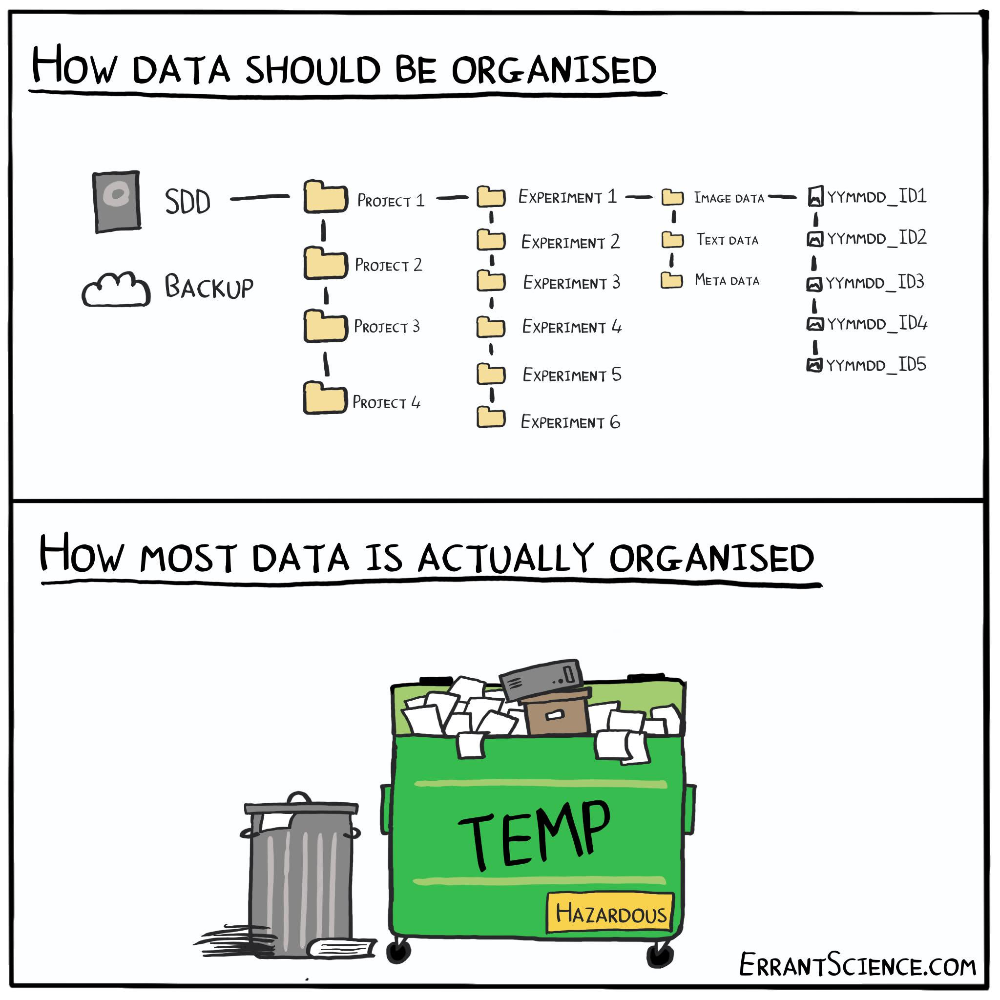
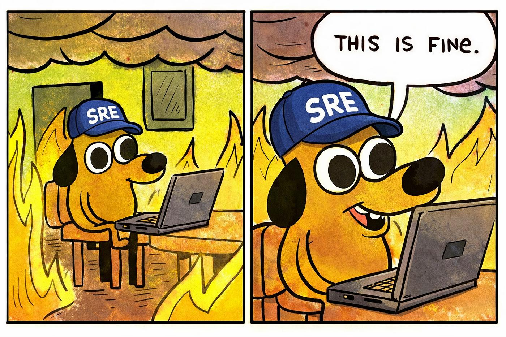

# Bienvenida

## Objetivo del minicurso

Al final del minicurso queremos poder seguir un flujo de trabajo como::

```text
archivos de datos
      ↓
proyecto organizado
      ↓
Análisis 
      ↓
figuras e interpretación
      ↓
Git / GitHub
```

Se trata de empezar a trabajar de forma **reproducible**.

::: {.notes}
Enfatizar que el curso no intenta cubrir “todo Python” ni “todo Git”. El objetivo es construir un flujo de trabajo útil para el primer semestre del posgrado.
:::

## La historia María Luisa

Estudiante de primer ingreso al DOF. Su asesora le da tres tipos de datos:

- temperatura superficial del mar frente a Baja California;
- precipitación en Ensenada;
- índice ONI.

Su pregunta inicial es:

> **¿Cómo se relacionan ENSO, la SST regional y la precipitación local durante los últimos 30 años?**

## ¿Qué haremos hoy?

Hoy todavía no analizaremos los datos.

Hoy aprenderemos a:

- movernos en la computadora desde la terminal;
- inspeccionar archivos y directorios;
- organizar un proyecto científico;
- distinguir archivos de datos, código, figuras y documentación;
- abrir JupyterLab desde el proyecto.

## ¿Por qué empezar con la terminal?

Tarde o temprano van a necesitar:

- organizar muchos archivos;
- correr scripts;
- usar servidores o clusters;
- repetir análisis;
- compartir proyectos con otras personas;
- entender qué está pasando cuando algo falla.

¡La terminal conecta todo!


# El proyecto ENSO–Baja

## El escenario

María Luisa recibió una carpeta llamada:

```text
materiales_sesion1/
```

Dentro hay archivos mezclados:

```text
materiales_sesion1/
├── descargas/
├── notas/
└── README_inicial.txt
```

Su primera tarea es **entender qué tiene**.

## Los datos del proyecto

Durante el minicurso trabajaremos con tres fuentes:

```text
sst_baja_mensual_1994_2024.nc
precipitacion_ensenada_mensual.csv
oni_mensual.csv
```

(Ojo que hoy son archivos con datos sintéticos)

Lo importante por ahora es aprender a:

- encontrarlos;
- reconocerlos;
- organizarlos;
- preparar el proyecto para analizarlos después.

## 

Al final de la sesión 1 tendremos una carpeta que se verá así:

```text
enso_baja/
├── data/
├── notebooks/
├── scripts/
├── figures/
├── README.md
└── environment.yml
```

Éste será el proyecto que seguiremos usando en las sesiones 2 y 3.

# Brevísima introducción
## Un poquito de historia de la terminal {.smaller .scrollable}

:::: {.columns}

:::{.column width="60%"}

Las computadoras realizan cuatro funciones básicas:
  
  * Ejecutar programas
  * Guardar datos
  * Comunicarse entre ellas
  * Interactuar con nosotros


**Interfaces**: desde conexiones cerebro-computadora y voz → hasta pantallas, ratones, teclados.

Las **interfaces gráficas (GUI)** son comunes desde los 80s; origen en los 60s con Doug Engelbart y “La Madre de todos los Demos”.

:::

::: {.column width="40%"}


*Imagen de [ss64.com/bash/syntax-terminal.html](https://ss64.com/bash/syntax-terminal.html)*

Más info en: [unixdigest](https://unixdigest.com/articles/the-terminal-the-console-and-the-shell-what-are-they.html)
:::

::::

Antes de la GUI → solo existía la interfaz de **línea de comandos** (CLI).

Entrada/salida limitada a texto (teclado estándar, impresoras de línea).

Basada en el ciclo REPL: leer (read) → ejecutar (execute) → imprimir (print) → repetir (loop).

## La terminal y su utilidad {.smaller}

**Terminal** (shell): programa intermediario entre usuario y sistema operativo.

Ejecuta otros programas en lugar de hacer cálculos directamente.

Ejemplo popular: **Bash** (Bourne Again Shell) en Unix/Linux.

Ventajas del uso de la terminal (CLI):

  * Comodidad para programar: comandos cortos y rápidos.
  * Permite combinar herramientas en pipelines.
  * Automatización de tareas → productividad y reproducibilidad.
  * Interacción sencilla con máquinas remotas y supercomputadores.

¡Es una habilidad clave en computación científica, clusters y la nube!


# Abrir la terminal

## ¿Qué es la terminal?

La terminal es una interfaz de texto para hablar con la computadora.

Nos permite escribir comandos como:

```bash
pwd
ls
cd
```

La computadora responde con texto.

## Para empezar

Abre una terminal:

**Mac**

Cmd + Space &rarr;
escribir Terminal &rarr;
Enter

**Windows**

tecla Windows &rarr;
escribir Git Bash &rarr;
Enter

**Linux**

Ctrl + Alt + T

## ¿Dónde estamos?

En la terminal:

```bash
pwd
```

Este comando significa:

> **print working directory**

Nos dice dónde estamos.

## Directorio de trabajo

En cada momento la terminal está “parada” en un directorio.

A ese lugar le llamamos:

> **directorio de trabajo actual**

Muchos comandos actúan sobre ese directorio.

Por eso `pwd` es nuestro primer comando de seguridad.

## Ver qué hay aquí

```bash
ls
```

`ls` muestra el contenido del directorio actual.

También podemos pedir más información:

```bash
ls -l
```

o distinguir directorios:

```bash
ls -F
```

## Reto 1 · ¿Dónde estoy?

Ejecuta:

```bash
pwd
ls
ls -F
```

Responde:

1. ¿En qué directorio estás?
2. ¿Qué archivos o carpetas ves?
3. ¿Puedes identificar cuál es la carpeta del curso?

# Navegación

## Cambiar de directorio

```bash
cd nombre_del_directorio
```

Ejemplo:

```bash
cd materiales_sesion1
```

Luego:

```bash
pwd
ls
```

## Subir un nivel

```bash
cd ..
```

`..` significa:

> el directorio que está arriba del actual

`.` significa:

> el directorio actual

## Ir al home

```bash
cd ~
```

o simplemente:

```bash
cd
```

`~` representa tu directorio personal.

## Cuando llevas cuatro `cd ..` y ya no sabes dónde estás


Usa `pwd` :-)


## Rutas relativas y absolutas

Una **ruta relativa** depende de dónde estás:

```bash
cd descargas
cd ../notas
```

Una **ruta absoluta** empieza desde la raíz del sistema:

```bash
/Users/karina/...
/home/usuario/...
```

## Reto 2 · Rutas

Supón que estás en:

```text
materiales_sesion1/descargas/
```

¿Qué comando te lleva a:

```text
materiales_sesion1/notas/
```

?

Opciones:

1. `cd notas`
2. `cd ../notas`
3. `cd ../../notas`
4. `cd /notas`

. . .

Respuesta: `cd ../notas`

## Pista muy útil

Usa la tecla **Tab**.

La terminal puede completar nombres de archivos y directorios.

Ejemplo:

```bash
cd mate<Tab>
```

Esto evita muchos errores de escritura.

# Inspeccionar archivos

## ¿Qué archivos tenemos?

Desde la carpeta del material:

```bash
ls
ls descargas
ls notas
```

También podemos listar sólo ciertos tipos de archivos:

```bash
ls descargas/*.csv
ls descargas/*.nc
ls notas/*.txt
```

## Comodines

El símbolo `*` significa:

> cualquier secuencia de caracteres

Ejemplos:

```bash
ls *.txt
ls *.csv
ls sst_*.nc
```

Esto será muy útil cuando tengamos muchos archivos.

## Ver el inicio de un archivo de texto

```bash
head notas/README_datos.txt
```

`head` muestra las primeras líneas de un archivo.

Para archivos grandes, es más seguro que abrir todo el archivo.

## Ver todo un archivo corto

```bash
cat notas/README_datos.txt
```

`cat` imprime el contenido completo.

Usarlo sólo con archivos pequeños.

## Contar líneas

```bash
wc -l descargas/oni_mensual.csv
```

`wc -l` cuenta líneas.

Esto sirve para revisar rápidamente el tamaño de un archivo de texto.

## Reto 3 · Primer diagnóstico de datos

Usando la terminal, responde:

1. ¿Cuántos archivos `.csv` hay?
2. ¿Cuántos archivos `.nc` hay?
3. ¿Cuántas líneas tiene el archivo del ONI?
4. ¿Qué columnas parecen tener los archivos `.csv`?

Comandos sugeridos:

. . . 

```bash
ls descargas/*.csv
ls descargas/*.nc
wc -l descargas/oni_mensual.csv
head descargas/oni_mensual.csv
```

# Crear el proyecto

## ¿Por qué organizar un proyecto?

:::: {.columns}

:::{.column width="50%"}

Un proyecto reproducible separa:

- datos;
- código;
- figuras;
- documentación;
- configuración del ambiente.

:::

::: {.column width="50%"}



:::

::::

Si todo vive en el mismo directorio, el análisis se vuelve frágil.


## Crear el directorio principal

Desde donde quieras guardar tu trabajo:

```bash
mkdir enso_baja
cd enso_baja
```

Revisamos:

```bash
pwd
ls
```

## Crear subdirectorios

```bash
mkdir data notebooks scripts figures
```

Revisamos:

```bash
ls -F
```

Esperamos ver:

```text
data/  figures/  notebooks/  scripts/
```

## Crear documentación inicial

```bash
touch README.md
```

`touch` crea un archivo vacío si no existe.

Después:

```bash
ls -F
```

## Copiar datos al proyecto

Desde dentro de `enso_baja/`, si el material está al lado:

```bash
cp ../materiales_sesion1/descargas/*.csv data/
cp ../materiales_sesion1/descargas/*.nc data/
cp ../materiales_sesion1/environment.yml .
```

Revisamos:

```bash
ls data
```

## Copiar vs mover

```bash
cp archivo destino
```

copia.

```bash
mv archivo destino
```

mueve o renombra.

Hoy preferimos copiar los datos originales.

## Reto 4 · Construir el proyecto

Crea esta estructura:

```text
enso_baja/
├── data/
├── notebooks/
├── scripts/
├── figures/
└── README.md
```

Después copia los archivos `.csv` y `.nc` a `data/`.

Verifica con:

```bash
ls -F
ls data
```

# Cuidado con borrar

## Borrar archivos

```bash
rm archivo
```

`rm` elimina archivos.

En la terminal normalmente no hay “papelera”.


## Yo, 0.3 segundos después de ejecutar rm en el directorio equivocado




 ¡Si borras algo con `rm` puede ser imposible recuperarlo!

## Borrar directorios vacíos

```bash
rmdir directorio_vacio
```

No usaremos comandos de borrado recursivo hoy.

## Regla de seguridad

Antes de borrar:

```bash
pwd
ls
```

Pregúntate:

> ¿Estoy donde creo que estoy?

# Salida, redirección y pipes

## Guardar la salida de un comando

```bash
ls data > lista_archivos.txt
```

`>` redirige la salida a un archivo.

Después:

```bash
cat lista_archivos.txt
```

## Combinar comandos

```bash
ls data | wc -l
```

El símbolo `|` se llama **pipe**.

Toma la salida de un comando y la usa como entrada del siguiente.

## Reto 5 · Inventario rápido

Crea un archivo llamado:

```text
inventario_datos.txt
```

que contenga la lista de archivos dentro de `data/`.

Pista:

. . . 

```bash
ls data > inventario_datos.txt
```

Luego revísalo con:

```bash
cat inventario_datos.txt
```

# Ambientes de Python

## Pero en mi computadora sí funciona...


## ¿Por qué necesitamos un ambiente?

Un proyecto científico depende de software:

- Python;
- xarray;
- pandas;
- matplotlib;
- netCDF4;
- JupyterLab.

Un ambiente permite agrupar esas dependencias.

## Crear el ambiente

```bash
conda env create -f environment.yml
````

Se crea el ambiante a partir de la lista de paquetes en el archivo yaml

## Activar el ambiente

Para el curso usaremos:

```bash
conda activate oceanografia
```

Después podemos revisar:

```bash
python --version
which python
```

En Windows es (creo):

```bash
where python
```

## Arrancar JupyterLab desde el proyecto

Primero asegúrate de estar en `enso_baja/`:

```bash
pwd
ls
```

Luego:

```bash
jupyter lab
```

Jupyter abrirá el proyecto desde ese directorio.

## Crear el primer notebook

En JupyterLab:

1. entra a `notebooks/`;
2. crea un notebook nuevo;
3. llámalo `exploracion_inicial.ipynb`;
4. escribe una celda Markdown con la pregunta del proyecto.

Ejemplo:

```markdown
# Exploración inicial ENSO–Baja

Pregunta: ¿cómo se relacionan ENSO, SST frente a Baja California y precipitación en Ensenada?
```

## Primer código en el notebook

En una celda de Python:

```python
from pathlib import Path

project = Path("..")
data_dir = project / "data"

list(data_dir.iterdir())
```

No importa si todavía no entiendes todos los detalles.

La idea es conectar Jupyter con la estructura del proyecto.

#  Lo que hicimos hoy

Hoy aprendimos a:

- ubicarnos con `pwd`;
- listar archivos con `ls`;
- movernos con `cd`;
- usar rutas relativas;
- crear directorios con `mkdir`;
- crear archivos con `touch`;
- copiar con `cp`;
- inspeccionar texto con `head`, `cat`, `wc`;
- usar comodines `*`;
- activar un ambiente;
- abrir JupyterLab desde el proyecto.

## El proyecto después de la sesión 1

```text
enso_baja/
├── data/
│   ├── sst_baja_mensual_1994_2024.nc
│   ├── precipitacion_ensenada_mensual.csv
│   └── oni_mensual.csv
├── notebooks/
│   └── exploracion_inicial.ipynb
├── scripts/
├── figures/
├── README.md
└── inventario_datos.txt
```

## Pregunta para la sesión 2

Ya tenemos un proyecto organizado.

Ahora necesitamos abrir los datos.

Preguntas:

- ¿qué contiene el NetCDF de SST?
- ¿cómo leemos los CSV de precipitación y ONI?
- ¿cómo convertimos datos en figuras?
- ¿cómo calculamos anomalías mensuales?

## Mini tarea opcional

Antes de la siguiente sesión:

1. abre tu proyecto en la terminal;
2. activa el ambiente;
3. abre JupyterLab;
4. crea o edita `notebooks/exploracion_inicial.ipynb`;
5. escribe en Markdown qué crees que contiene cada archivo de datos.

No tienes que analizar nada todavía.

Sólo deja el proyecto listo.

## Comandos esenciales de hoy

```bash
pwd
ls
cd
mkdir
touch
cp
mv
rm
head
cat
wc -l
conda activate oceanografia
jupyter lab
```
